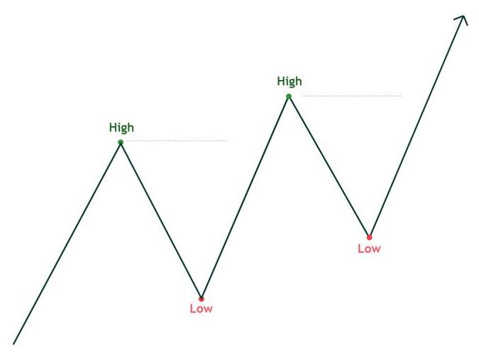
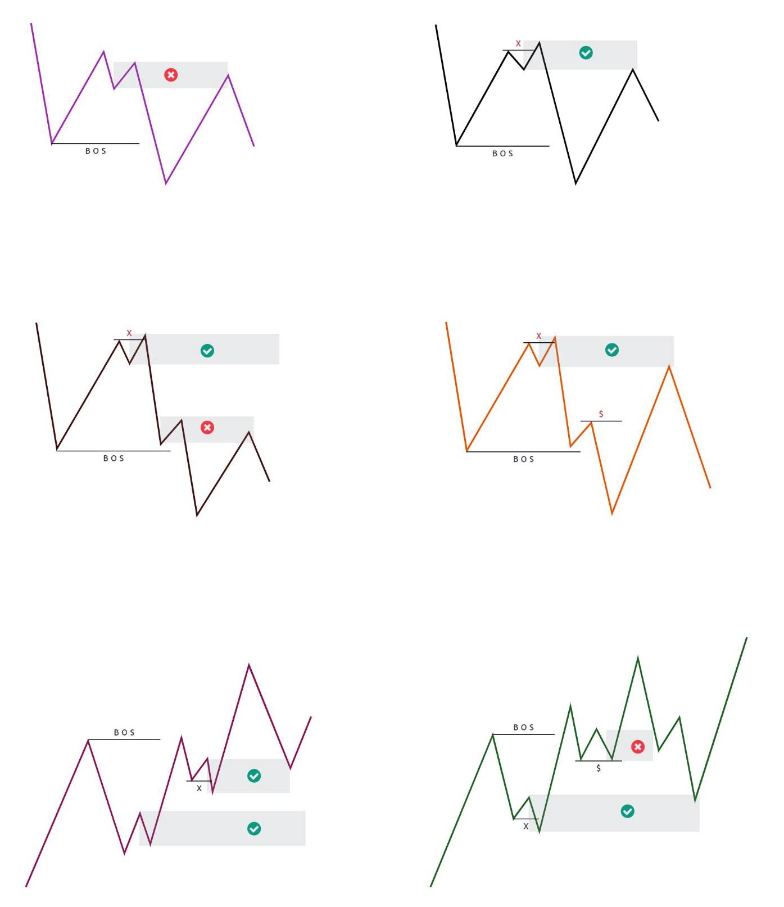
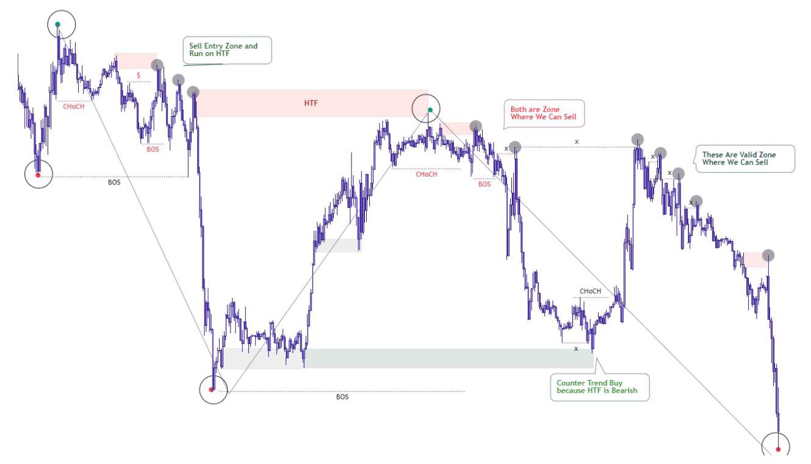
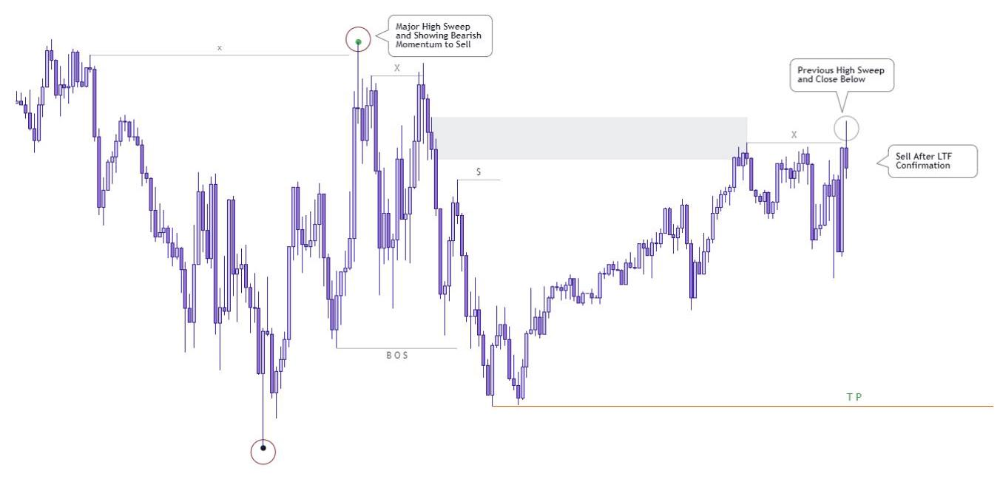

MR.KHAN

## RISK DISCLAIMER

## 风险声明

Please Read Disclaimer Carefully. Trading Hub is not a registered investment, legal or tax advisor or a broker/dealer. All investment/ financial opinions expressed by Trading Hub are from the personal research and experience and are intended as educational material. Although

请仔细阅读声明。交易中心不是注册投资顾问、法律或税务顾问，也不是经纪商/交易商。交易中心表达的所有投资/财务观点均来自个人研究和经验，旨在作为教育材料。尽管

best efforts are made to ensure that all information is accurate and up to date, occasionally unintended errors and misprints may occur. Leverage Trading is High Risk Business so Trade Carefully on You're Risk Research, we are not Responsible For You're Profit and Loss.

已尽最大努力确保所有信息准确且最新，但偶尔可能会出现意外的错误和印刷错误。杠杆交易是高风险业务，因此请根据您的风险研究谨慎交易，我们不对您的盈亏负责。

We're Wishing You Successful Trading Journey . All Right Reserve (C) 2022 @ @trading_hub_

祝您交易之旅成功。保留所有权利 (C) 2022 @ @trading_hub_

## WELCOME

## 欢迎

AU

To The Financial Markets - Lets Beat The Retailer and Trade Like Banks & Institutional Whales .

来到金融市场 - 让我们击败散户，像银行和机构巨头一样交易。

# TRADING HUB 2.0 BEAT THE RETAIL TRADER -TRADE LIKE BANKS

# 交易中心2.0 击败散户 - 像银行一样交易

All Right Reserve © 2022 @ @trading_hub_

保留所有权利 © 2022 @ @trading_hub_

## Daily use Keywords in trading

## 交易中的日常使用关键词

SMC Smart Money Concept

SMC 聪明钱概念(Smart Money Concept)

BOS Break of Structure

BOS 结构突破(Break of Structure)

CHoCH Change of Character

CHoCH 特征变化(Change of Character)

OB Order Block

OB 订单块(Order Block)

OF Order Flow

OF 订单流(Order Flow)

IFC Institutional Funding Candle

IFC 机构资金蜡烛图(Institutional Funding Candle)

FVG Fair Value Gap

FVG 公允价值缺口(Fair Value Gap)

IPA Inefficient Price Action

低效价格行为(IPA)

IMB Imbalance

失衡(IMB)

POI Price of interest

关注价格(POI)

AOI Area of interest

关注区域(AOI)

SMT Smart Money Trap

聪明钱陷阱(SMT)

HTF Higher Time Frame

更高时间框架(HTF)

LTF Lower Time Frame

更低时间框架(LTF)

IDM Inducement

诱因(IDM)

EQH Equal High

等高(EQH)

EQL Equal Low

等低(EQL)

SnR Support and Resistance

支撑位和阻力位(SnR)

D2S Demand to Supply

需求与供给(D2S)

S2D Supply to Demand

供给与需求(S2D)

ERL Engineering Liquidity

工程流动性(ERL)

BSL Buy Side Liquidity

买方流动性(BSL)

SSL Sell Side Liquidity

卖方流动性(SSL)

TL Trendline

TL趋势线

PDH Previous Day High

PDH前一日最高价

PDL Previous Day Low

PDL前一日最低价

PWH Previous Week High

PWH前一周最高价

PWL Previous Week Low

PWL前一周最低价

HOD High of the Day

HOD当日最高价

LOD Low of the Day

LOD当日最低价

SOS Sign of Strength

SOS强势信号

SOW Sign of Weakness

SOW弱势信号

@ @trading_hub_

@ @交易中心_

## Table of Contents

## 目录

Complete Mastery in Trend identification

趋势识别的完全掌握

Valid BOS/CHoCH identification

有效BOS/CHoCH识别

Mastery in Order Block / FVG / IMB / IFC

订单块/FVG/IMB/IFC的掌握

Retail / SMC / Banks - Institutional

零售/简单市场结构/银行 - 机构

Types of Liquidity / Advance Liquidity

流动性类型/进阶流动性

High Probability Entries / Ping Pong / Sniper Entry/ Multiple Entries Scale / Single Candle Mitigation Entry

高概率入场 / 乒乓策略 / 狙击入场 / 多入场规模 / 单根蜡烛线缓解入场

Multiple Time Frame Analysis Live Case Studies / Putting All Together

多时间框架分析实战案例研究 / 综合运用

- Trade Management

- 交易管理

- Psychology

- 交易心理

All Right Reserve © 2022 @ @trading_hub_

版权所有 © 2022 @ @trading_hub_

## What is Trend ?

## 什么是趋势？

You must have heard many times that "Trend is You're Friend until it Bend" then why Most People trap to identify a valid Trend But-

你肯定多次听过 “趋势是你的朋友，直到它转弯”，那么为什么大多数人难以识别有效的趋势呢？但是 -

No Need to worry Now , Actually this is Not you're Fault , We all know what we have heard To others Traders and seen on the internet that when the market goes up it is called Bullish market and going to Down is called Bearish market. , Buy it when it goes up while making it Higher High and sell it when the market Make Lower Lows . It's a simple story.

现在无需担心，实际上这不是你的错，我们都知道我们从其他交易者那里听到的以及在互联网上看到的，当市场上涨时称为牛市，下跌时称为熊市。当市场上涨并创出更高高点时买入，当市场创出更低低点时卖出。这是个简单的道理。

Bullish Trend

牛市趋势

TRADING HUB 2.0 All Right Reserve © 2022

交易中心2.0 版权所有 © 2022

Bearish Trend

熊市趋势

## Major Trend vs Minor Trend

## 主要趋势与次要趋势

In Major Trend and Minor Trend, maximum people get confused and they are not able to mark the trend properly. In the chart given below, you can see how HTF and LTF structures are marked and this is a simple method. But many people also find it difficult that how do we mark the original high and low. As we move forward, things will keep on progressing a little bit, so look at each line and point very carefully and read it. Here is an example of a bear market. Similar things work in a bullish market like this. Only the chart will turn bullish. To make your problem easier, in the next topic, we cover how to mark real and valid market structure.

在主要趋势和次要趋势中，大多数人会感到困惑，无法正确标记趋势。在下面的图表中，你可以看到高时间框架(HTF)和低时间框架(LTF)结构是如何标记的，这是一种简单的方法。但很多人也觉得难以确定如何标记原始的高点和低点。随着我们继续讲解，情况会逐渐清晰，所以请非常仔细地查看每条线和每个点并阅读。这是一个熊市的例子。在牛市中情况类似，只是图表会转为牛市形态。为了让你的问题更简单，在下一个主题中，我们将介绍如何标记真实有效的市场结构。

A large time frame depends on your trading style whether you are an intraday trader or a swing trader or positional trader.

大时间框架取决于你的交易风格，无论你是日内交易者、波段交易者还是头寸交易者。

The H1 time frame can be a higher time frame for the day trader and the same time frame can be shorter for the H1 swing or position. This is not a fix, it has to be managed according to your trading style. Which we will tell you further which time frame is right for you and how to apply. All Right Reserve © 2022 ) @trading_hub_

对于日内交易者来说，H1时间框架可能是较高时间框架，而对于H1波段或头寸交易者来说，同一时间框架可能较短。这不是固定不变的，必须根据你的交易风格来管理。我们将进一步告诉你哪个时间框架适合你以及如何应用。版权所有 © 2022 ) @trading_hub_

## Identify Valid Structure

## 识别有效结构

This is a very important part of SMC and I can say this with certainty that Max people are not able to mark the structure properly. The reason for that is not you, it is your education system, which tells us the same things that everyone does, but if it was so, then why not everyone is able to make money. And everyone knows that the trend is your friend, yet people continue to do as we have been taught, and Banks Intuitions takes advantage of this. But now there is nothing to worry about, now you will be able to improve things to a great extent and your angle of view of the market will change at once.

这是市场微观结构分析(SMC)中非常重要的一部分，我可以肯定地说，大多数人都无法正确标记结构。原因不在于你，而在于你的教育体系，它告诉我们的东西和其他人一样，但如果真是这样，那为什么不是每个人都能赚钱呢？而且每个人都知道趋势是你的朋友，但人们仍然继续按照我们所学的方式去做，而银行机构则利用了这一点。但现在没什么可担心的了，现在你将能够在很大程度上改善情况，你对市场的看法也会立刻改变。

Bearish Structure

看跌结构

Small structures make up a main leg And when Price breaks the Recent high of the previous minor structure, then our HTF Low is confirmed. Right now we are talking about Bearish Market only, for your understanding In the next page we make it a little more easy. You can understand the examples given below.

小结构构成一个主要波段，当价格突破先前小结构的近期高点时，那么我们的更高时间框架(HTF)低点就得到确认。目前我们只讨论看跌市场，为了便于理解，在下一页我们会讲得更简单一些。你可以理解下面给出的例子。

Now you must have understood how we have to mark the structure. And what are the things to keep in mind. These are all referring to the bearish structure and all bearish examples. Even in bullish market the concept works Same , just your trend will be bullish.

现在你一定已经明白我们如何标记结构了。以及需要牢记哪些要点。这些都是指看跌结构和所有看跌的例子。即使在看涨市场中，这个概念同样适用，只是你的趋势将是看涨的。

## Bullish Structure

## 看涨结构

The same rules apply here to identify Original High ( \( \mathrm{{HH}} \) ) as we just studied the bearish structure Above . You can understand from the example given below.

这里应用与我们刚才研究的看跌结构相同的规则来确定原始高点(\( \mathrm{{HH}} \))。你可以从下面给出的例子中理解。

All Right Reserve © 2022

版权所有 © 2022

## BOS vs CHoCH

## 结构突破(BOS)与特征变化(CHoCH)

## BOS ( Break of Structure )

## 结构突破(BOS)

Break of structure is full name of BOS. As you must have got the idea after hearing the name that some structure is being talked about. When the market breaks its Previous swing low, then that condition is called BOS. And when the market goes up and it breaks high, then it is also called BOS, it is also called BMS by some traders (Break Market Structure). You can understand the example given below. Just now we had studied the Bearish structure. Now let us see in the Bullish structure how to identify the BOS.

结构突破是BOS的全称。正如你听到这个名字后一定已经有了概念，即正在谈论某种结构。当市场跌破其先前的摆动低点时，那么这个情况就称为结构突破。而当市场上涨并突破高点时，这也称为结构突破，一些交易者也称之为市场结构突破(BMS)。你可以理解下面给出的例子。刚才我们研究了看跌结构。现在让我们看看在看涨结构中如何识别结构突破。

All Right Reserve © 2022

版权所有 © 2022

You can understand the example given below, which is explained in complete detail.

你可以理解下面给出的例子，它解释得非常详细。

All Right Reserve © 2022

版权所有 © 2022

---

CHoCH ( Change of Character )

特征变化(CHoCH)

---

Change of Character is formed when the price mitigates a supply or demand and breaks the first recent Minor/Major structure High/Low, it is called ChoCH. CHoCH and BOS may look a like in appearance but there is a lot of difference between these two. Bos are formed only in trend continuation whether trend is Bullish or Bearish . CHoCH becomes only on the supply-demand . it acts as a trend reversal. You can easily understand from the example given below. All Right Reserve (C) 2022

当价格缓解了供应或需求并突破最近的第一个小/大结构的高/低时，就形成了特征变化，这被称为CHoCH。CHoCH和BOS在外观上可能看起来相似，但这两者之间有很大的区别。BOS仅在趋势延续时形成，无论趋势是看涨还是看跌。CHoCH仅基于供应 - 需求形成。它起到趋势反转的作用。你可以从下面给出的例子中轻松理解。版权所有 (C) 2022

## IMB ( Imbalance )

## 失衡(IMB)

When the price starts rising sharply or starts falling then it is called as Unhealthy Price Action. A gap is formed between the candles, that is called imbalance, it is also known by other names such as FVG ( Fair Value Gap ) inefficiency. We understand from the example given below. OF ( Order Flow )

当价格开始急剧上涨或下跌时，这被称为不健康的价格行为。蜡烛图之间形成了缺口，这被称为失衡，它也有其他名称，如公平价值缺口(FVG)效率低下。我们从下面给出的例子中可以理解。订单流(OF)

All Right Reserve © 2022

版权所有 © 2022

A specific area which is formed before the buy sell trend, you can understand like this last buying move before sell is called Bearish Order Flow. Same rule applies in buy condition that last selling Move before buy is called Bullish Order Flow. Let us understand it a little more simply by the example given below.

在买卖趋势之前形成的一个特定区域，你可以这样理解，在卖出之前的最后一次买入动作被称为看跌订单流。在买入情况下同样的规则适用，即在买入之前的最后一次卖出动作被称为看涨订单流。让我们通过下面给出的例子更简单地理解一下。

All Right Reserve © 2022

版权所有 © 2022

## OB ( Order Block )

## OB(订单块)

The order blocks are similar to the Order Flow in appearance and have the same function, but the only difference is that Order Block made from a single candle. Last buying candle before sell is called Bearish order block and last selling candle before buy is called Bullish order block. It is necessary to have a proper imbalance with the order block then it will become a valid and high probability order block. There may be a slight difference in the shape of the candle, Only you have to confirm to see Candle Behavior. You can understand from the example given below. IFC ( Institutional Funding Candle )

订单块在外观上与订单流相似且功能相同，但唯一的区别是订单块由单个蜡烛图形成。卖出之前的最后一个买入蜡烛图被称为看跌订单块，买入之前的最后一个卖出蜡烛图被称为看涨订单块。与订单块有适当的失衡是必要的，然后它将成为一个有效的且高概率的订单块。蜡烛图的形状可能会有细微差异，你只需要确认蜡烛图行为。你可以从下面的例子中理解。机构资金蜡烛图(IFC)

BULLISH ORDER BLOCK

看涨订单块

B O S

B O S

imbalance

失衡

Bullish Order Block

看涨订单块

All Right Reserve © 2022 @ @trading_hub_

版权所有 © 2022 @ @trading_hub_

This is the last and interested candlestick of the (AOI) Area of interest, IFC and Order blocks are completely Similar . Only one minor difference is that it Sweep high/low of the previous candle and Push Higher or Lower. This condition is commonly referred to as grabbing liquidity. When an order block collects the stop loss high/low of the previous candle and goes up or Down. The details about liquidity are covered in the next topic. Let's understand How Institutional Funding Candle Work..

这是(AOI)感兴趣区域的最后一个且有趣的蜡烛图，机构资金蜡烛图(IFC)和订单块完全相似。唯一的一个小区别是它扫过前一个蜡烛图的高/低并推高或推低。这种情况通常被称为抓取流动性。当一个订单块收集了前一个蜡烛图的止损高/低并上涨或下跌时。关于流动性的详细信息将在下一个主题中介绍。让我们了解一下机构资金蜡烛图是如何运作的。

## Retail / SMC / Banks

## 零售/简单市场结构/银行

## Retail Traders

## 零售交易者

We are all retail traders, no matter what strategy we have come to work on. Support resistance , EMA or price action based on trendline. Some people work only on candlesticks but all these are theory of retail traders. After all, we have learned everything like this, so why does it not work? Why do people Fail and Why are unable to make money and lose their money Easily. Let's see why they Fail. All Right Reserve © 2022 SMC Traders Trap

我们都是零售交易者，无论我们采用何种策略来交易。基于支撑阻力、指数移动平均线(EMA)或基于趋势线的价格行为。有些人只研究蜡烛图，但所有这些都是零售交易者的理论。毕竟，我们都是这样学习的，那么为什么它不起作用呢？为什么人们会失败，为什么无法赚钱反而轻易亏钱。让我们看看他们为什么失败。版权所有 © 2022 简单市场结构交易者陷阱

In These days many people are Trading based on SMC but they are still in loss or on breakeven. I believe the main reason for this is education. After Learn BOS CHOCH it seems that now SMC has understood everything. Now we can also trade like banks, Institutional SMC. But the response is worse than a retail trader. Let' see how SMC traders are trap After this we will talk about the most important topic Regarding liquidity. which acts as the fuel for trading. Few SMC Trap Examples Given Below.

如今很多人基于简单市场结构(SMC)进行交易，但他们仍处于亏损或收支平衡状态。我认为主要原因是教育。在学习了BOS CHOCH之后，似乎现在对简单市场结构已经完全理解了。现在我们也可以像银行、机构简单市场结构那样交易了。但结果比零售交易者更糟。让我们看看简单市场结构交易者是如何陷入陷阱的。在此之后我们将讨论关于流动性的最重要的主题。流动性是交易的燃料。下面给出一些简单市场结构陷阱的例子。

All Right Reserve © 2022

版权所有 © 2022

## Banks / Institutional

## 银行/机构

First thing I am not a Banker or Institute but I have learned a lot from my experience, made many losses even blown many accounts, which everyone does. We are all the same but everyone has a different way of looking at things. I Study the market, back test it and Finally understand how banks actually work and how we can do like them. How can I read charts like them. Banks Always Move Against Us when you buy then they Sell . They Trap on Breakout, Support , Trendline , Chart Pattern and indicators etc. How They Trades Some charts are given below.

首先，我不是银行家或机构人员，但我从自己的经历中学到了很多，有过很多亏损，甚至爆仓，这是每个人都会经历的。我们都一样，但每个人看待事物的方式不同。我研究市场，进行回测，最终了解银行实际是如何运作的，以及我们如何效仿它们。我如何像它们一样解读图表。当你买入时，银行总是与我们反向操作然后卖出。它们在突破、支撑位、趋势线、图表形态和指标等方面设陷阱。以下是它们的一些交易图表。

## Type of Liquidity

## 流动性类型

As we all know, fuel is needed to move a car, liquidity is needed to move the market up and down. Unless there is liquidity available in the market, there will be no movement in the market. These are collected from Liquidity Retailer Traders in which you and me all are involved. There are many types of liquidity but I will just tell you about the main Types liquidity.

众所周知，汽车行驶需要燃料，市场涨跌需要流动性。除非市场有流动性，否则市场不会有波动。这些流动性是从包括你我在内的零售流动性交易者那里收集来的。流动性有很多种类型，但我只告诉你主要的几种流动性类型。

RELEVANT EQUAL LOWS

相关等同低点

EQUAL HIGH RELEVANT EQUAL HIGH

等同高点 相关等同高点

All Right Reserve © 2022 @ @trading_hub_

版权所有 保留所有权利 © 2022 @ @trading_hub_

Most Retail traders takes Entry based on trendline chart patterns and support - resistance. Most of the manipulation also happens in the Both strategy. Because where Retailers will be maximum then maximum liquidity will be collect. And Smart Traders Bank takes Benefit of it. Some of the most tradable patterns and strategies given the Below.

大多数零售交易者根据趋势线图表形态以及支撑位和阻力位来入场。大多数操纵行为也发生在这两种策略中。因为零售商最多的地方，收集到的流动性就最多。而聪明的交易银行会利用这一点。以下是一些最具交易价值的形态和策略。

## Advance Liquidity

## 高级流动性

External Range Liquidity

外部区间流动性

What I just explained behind was a simple general type of liquidity which is commonly taught to SMC traders. And some people will even be aware of that things. Now let's talk about Advance SMC. In which Mostly SMC traders are also trapped along with retail traders. I will talk about liquidity. Let's go into detail about External Liquidity, Internal Liquidity, Engineering Liquidity and Inducement and understand how it works. Let us understand with some examples and diagrams given below.

我刚才解释的是一种简单的常见流动性类型(通常教给SMC交易者)。有些人甚至知道这些。现在让我们谈谈高级SMC。在这方面，大多数SMC交易者和零售交易者一样也会陷入困境。我将谈谈流动性。让我们详细了解外部流动性、内部流动性、工程流动性和诱导因素，并了解其运作方式。让我们通过下面给出的一些例子和图表来理解它。

All Right Reserve © 2022

版权所有 保留所有权利 © 2022

## Internal Range Liquidity

## 内部区间流动性

On every Major Structure High/Low Create External Liquidity and Between Both Major High/Low Price Create Internal Structure and Internal Structure Create internal Liquidity. so this is very important to understand External/liquidity Difference. Lets See How it Looks . All Right Reserve © 2022

在每个主要结构的高点/低点会产生外部流动性，而在两个主要高点/低点之间的价格会形成内部结构，内部结构会产生内部流动性。所以理解外部/流动性差异非常重要。让我们看看它是什么样的。版权所有 保留所有权利 © 2022

## IDM ( Inducement )

## IDM(诱导因素)

As the name suggests, Induce means something that attracts you towards itself and you go with it, it is called Inducement. Whether your supply demand, Bos , Choch , Order Block or High/Low can be anything. This is main reason for FOMO Entry. Let us understand this with the help of charts and diagrams. All Right Reserve © 2022

顾名思义，诱导因素是指吸引你并让你跟随它的东西，这就叫诱导因素。无论你的供求关系、波峰、波谷、订单块还是高点/低点是什么。这是造成“害怕错过(FOMO)”式入场的主要原因。让我们借助图表来理解这一点。版权所有 保留所有权利 © 2022

All Right Reserve © 2022

版权所有© 2022

## ENGLQD ( Engineering Liquidity )

## 工程流动性(ENGLQD，Engineering Liquidity)

These are very similar to the internal range liquidity, the only difference is that they are formed before extreme order blocks, you can understand that when internal liquidity is created, the first recent high is called inducement and the last extreme one is called Engineering liquidity. And it gives very high probability setup. Let us understand it a little easier with a diagram and Charts. All Right Reserve (C) 2022

这些与内部区间流动性非常相似，唯一的区别是它们在极端订单块之前形成，你可以理解为当内部流动性形成时，第一个最近的高点称为诱导点，最后一个极端点称为工程流动性。而且它给出了概率非常高的交易机会。让我们通过图表更容易地理解它。版权所有(C)2022

## Entry Modules

## 入场模块

## CHoCH/BOS Entry

## CHoCH/BOS入场

When Price Tap on Valid Supply or Demand Level then Wait For LTF Confirmation Like BOS/CHoCH and Buy/Sell Entry Criteria .

当价格触及有效供应或需求水平时，等待低时间框架(LTF)的确认，如BOS/CHoCH以及买卖入场标准。

there is Not Any Fix Time Frame for HTF and LTF. But I'll let you know that how we can use it Multiple Time Frame in Multiple Time Frame Analysis Topic. Lets See How Structure Develop Before Buy / Sell . All Right Reserve © 2022

对于高时间框架(HTF)和低时间框架没有固定的时间范围。但我会在多时间框架分析主题中告诉你我们如何在多个时间框架中使用它。让我们看看在买卖之前结构是如何发展的。版权所有© 2022

SIMPLE CHOCH CHOCH WITH FLIP

简单的带有翻转的CHoCH

CHoCH

CHoCH

CHoCH

CHoCH

✘ IDM 5

✘ IDM 5

This Wick Act Like

这个影线的作用就像

HTF Demand HTF Demand Sweep the Low and BOS

高时间框架需求 高时间框架需求扫过低点并形成BOS

CHOCH WITH IDM SIMPLE CHOCH

带有IDM的CHoCH 简单的CHoCH

All Right Reserve © 2022 O @trading_hub_

版权所有© 2022 O @trading_hub_

## Single Candle Mitigation Entry

## 单根蜡烛线缓解入场

I hope you have learned a lot. Now your interest will keep on increasing. You must have got to see many new things. And what we are going to learn. Now it is very interesting and different, after Tap just Single candle, That how can we take Sniper Entry and how can we take single Candle Sweep Entry, let's see and understand. All Right Reserve © 2022

我希望你已经学到了很多。现在你的兴趣会不断增加。你一定已经看到了很多新事物。而我们接下来要学习的内容。现在非常有趣且与众不同，在点击单根蜡烛图之后，我们如何进行狙击入场以及如何进行单根蜡烛图扫盘入场，让我们来看看并理解。版权所有© 2022

## Ping Pong Entries

## 乒乓入场

When we play in both side probability. That condition is called ping pong, Basically ping pong is done for hedging. Let us understand it on diagram and chart. don't try to play directly on live ac first Back test and study Price action then continue, Ping Pong Entries Only Experience traders Can Play it so First Gain some experience then can continue. Scaling Entries

当我们在双边概率中交易时。那种情况就叫做乒乓，基本上乒乓是用于套期保值的。让我们在图表上理解它。不要先尝试直接在实盘账户上操作，先进行回测并研究价格行为，然后再继续。乒乓入场只有有经验的交易者才能操作，所以先积累一些经验再继续。加仓入场

If you do not want to scalein in trading, then you cannot become a good profitable trader. Because the risk of every trade is 50-50%, you will lose 50% but you have to scale up in what you will win 50%. So that you can earn big returns with your trades. To Stack Positions an Art. Let's see how we can do it.

如果你不想在交易中加仓，那么你就不可能成为一个盈利良好的交易者。因为每笔交易的风险都是50对50，你会有50%的亏损，但你必须在能盈利50%的方面加仓。这样你才能通过交易获得丰厚回报。加仓是一门艺术。让我们看看如何做到这一点。

MULTIPLE ENTRIES STACKING

多重入场加仓

All Right Reserve © 2022

版权所有© 2022

ORDER BLOCK CHEAT SHEET All Right Reserve © 2022 ◎ @trading_hub_

订单块速查表 版权所有© 2022 ◎ @trading_hub_

Remember- Order Block Without Inducement / Liquidity is No Value.

记住 - 没有诱多/流动性的订单块没有价值。

## Multiple Time Frame Analysis

## 多时间框架分析

Be it trading or any business, we can't buy/Sell the direction of that business from any one factor. We have to look at it from different angles, then we can get an idea of how much is actually in it. Same rule in trading is done by doing MTF (Multiple Time Frame ). We also can't Decide the direction of forex pair, stock or crypto coin from a single time frame for long term or short term direction, We Can forecast by doing multiple time frame analysis only. And make your trade decision-making. Let us understand with the help of some diagrams and charts. All Right Reserve (C) 2022

无论是交易还是任何业务，我们不能仅从一个因素就判断该业务的买卖方向。我们必须从不同角度去看，然后才能了解其中实际的情况。交易中的同样规则是通过进行多时间框架(MTF)分析来实现的。我们也不能仅从单个时间框架来决定外汇对、股票或加密货币的长期或短期方向，我们只能通过进行多时间框架分析来预测。并做出你的交易决策。让我们借助一些图表来理解。版权所有 (C) 2022

<table><tr><td>Trader Types</td><td>Higher Time Frame</td><td>Medium Time Frame</td><td>Lower Time Frame</td><td>Entry Time Frame</td></tr><tr><td>Positional Trader</td><td>W1</td><td>D1</td><td>H4</td><td>Below H4 ( H3 - H2 -H 1 )</td></tr><tr><td>Swing Trader</td><td>D1</td><td>H4</td><td>H1</td><td>Below H1 (M30 - M15)</td></tr><tr><td>Day Trader</td><td>H4</td><td>H1</td><td>M15</td><td>Below M15 (M5 - M2 - M1)</td></tr><tr><td>Scalper Trader</td><td>M15</td><td>M5</td><td>M5</td><td>M1 - Below M1</td></tr></table>

<table><tbody><tr><td>交易者类型</td><td>更高时间框架</td><td>中等时间框架</td><td>更低时间框架</td><td>入场时间框架</td></tr><tr><td>头寸交易者</td><td>W1</td><td>D1</td><td>H4</td><td>低于H4(H3 - H2 - H1)</td></tr><tr><td>波段交易者</td><td>D1</td><td>H4</td><td>H1</td><td>低于H1(M30 - M15)</td></tr><tr><td>日内交易者</td><td>H4</td><td>H1</td><td>M15</td><td>低于M15(M5 - M2 - M1)</td></tr><tr><td>剥头皮交易者</td><td>M15</td><td>M5</td><td>M5</td><td>M1 - 低于M1</td></tr></tbody></table>

MULTI TIME FRAME STRUCTURE

多时间框架结构

## Case Study

## 案例研究

So far we have learned a lot and I hope your mind will be opened at once. So let us now do some live trades case studies. By which you will get more help in understanding.

到目前为止，我们已经学到了很多，希望能立刻打开你的思路。那么现在让我们来做一些实盘交易案例研究。通过这些案例，你会在理解上得到更多帮助。

Given below are some trades case studies. GBPUSD - Case Study 2 GBPUSD - Case Study 5

以下是一些交易案例研究。英镑兑美元 - 案例研究2 英镑兑美元 - 案例研究5

GBPUSD - Case Study 1

英镑兑美元 - 案例研究1

All Right Reserve © 2022

版权所有© 2022

GBPUSD - Case Study 4

英镑兑美元 - 案例研究4

All Right Reserve © 2022

版权所有© 2022

## Trade Management

## 交易管理

If you are a good technical analyst, you can take good entry, you have knowledge of market. Even after all this, there is very little chance that you will be able to make money properly because your trade management should be strong. You don't need to be a sniper, you should know how to manage a good trade. Let's see if we can manage this.

如果你是一名优秀的技术分析师，你能很好地把握入场时机，也了解市场。即便如此，你能妥善盈利的机会依然很小，因为你的交易管理必须要强大。你不必成为一名神枪手，但你要知道如何管理好一笔交易。让我们看看能否做到这一点。

BUY SELLTRADE MANAGEMENT

买卖交易管理

All Right Reserve © 2022

版权所有© 2022

## Psychology

## 心理学

## Positive Mindset

## 积极心态

We are all human beings. It is in our nature to make mistakes. Mistakes happen the most and will continue to happen, you cannot stop it. But you can do one thing that you can definitely reduce your mistake. You can Mistake But Don't Repeat Same Mistake. Always keep a good positive mindset. What you have done till date cannot be changed, now you can change your future with what you are doing in the present. So stop thinking in the past and from today onwards do your best everyday in the present because this will make your future bright.

我们都是人。犯错是我们的天性。错误经常发生，还会继续发生，你无法阻止。但你可以做一件事，那就是绝对可以减少你的错误。你可以犯错，但不要重复同样的错误。始终保持良好的积极心态。你过去所做的无法改变，现在你可以通过当下正在做的事情来改变未来。所以不要再纠结过去，从今天起，每天在当下全力以赴，因为这会让你的未来充满光明。

## " No Poison can kill a Positive thinker and no medicine can save a negative thinker "

## “没有毒药能杀死积极思考者，也没有药物能拯救消极思考者”

## Trading/Gambling

## 交易/赌博

We all know that the probability of winning and losing a trade in the market is only 50%. But the chance of a trader being successful is only 10%. Because the rest 90% come to the market with the wrong mindset, they think it is a casino and they take trades on every trade just thinking that they will win or lose. But when they lose, they find ways to reduce their losses. Where they get maximum winrate. But the whole game is on the winning side. When you win, how much profit you take and how far you can take it is important. Because there will always be losses and it will happen to everyone, no one can ever deny them. That's why we should think with the mindset of a good trader. That we should know the reason for our loss. And let's accept loss, loss teaches you lesson which is very important to be a good trader. Accept the loss and move on. FOMO ( Fear of Missing Out )

我们都知道，在市场中交易的输赢概率各占50%。但交易者成功的几率只有10%。因为其余90%的人带着错误的心态进入市场，他们认为市场是赌场，每次交易时只想着会赢或输。但当他们亏损时，就会想办法减少损失。在能获得最高胜率的地方交易。但整个游戏的关键在于盈利方面。当你盈利时，你能获得多少利润以及能将利润扩大到什么程度很重要。因为亏损总是会发生，每个人都无法避免，没有人能否认这一点。这就是为什么我们应该以优秀交易者的心态思考。我们应该明白亏损的原因。并且让我们接受亏损，亏损会给你教训，这对成为一名优秀的交易者非常重要。接受亏损，然后继续前行。错失恐惧症(FOMO，Fear of Missing Out)

I have heard from many people that their trades went exactly as they expected after they put their stoploss. And later just say that such a big trend could not catch on. The reason for this is FOMO (Fear of Missing Out). You enter the market before your trades plan so that this entry should not be missed. But you should always remember that opportunities are like trains, one will go and the other will come. You should be patient and wait for a good entry. If you do this much then your chances of winning are gone.

我从很多人那里听说，他们设置止损后，交易走势完全如他们预期。但后来又说没能抓住那么大的趋势。原因就是错失恐惧症(FOMO，Fear of Missing Out)。你在交易计划之前就进入市场，生怕错过这次入场机会。但你要始终记住，机会就像火车，一辆开走，另一辆会来。你应该耐心等待，等待一个好的入场时机。如果你这么做了，那么你获胜的机会就没了。

## " The Fastest way to lose you're whole trading account is to try quickly double it "

## “让你输掉整个交易账户的最快方法就是试图迅速让它翻倍”

## Fear and Greed

## 恐惧与贪婪

This is one of the major reasons why a trader fails in trading. Fear is there before you take a trade, then there is a high possibility that you will not be able to make money from it, no matter how well the trade goes. Because when the trade went into profit, you will be more afraid that it may not turn back in the opposite direction. And thinking of this, greed starts coming in your mind and You Close Trade early and then Trade Drop more or push Higher. That's why you have to take trade fearlessly, you have to take your trading plan with confidence, no matter where it goes. You have to be strict on your rules. Only then will you be able to become a good fearless and professional trader. All Right Reserve (C) 2022 ◎ @trading_hub_ Emotional Intelligence The world's famous investor "Warren Buffett" has said that if you can't stop your emotion, you can't stop money either. This thing is completely true, so every person has as much wealth as he has the capacity to handle. And our capacity depends on our emotion. Money and emotion work in completely different directions to each other. We have to apply the same rule in our trading that you will not open any trade in emotion and will not close it in emotion. When you are trading you are looking at your trending chart and not MT4. Because when you see the benefit, greed comes in your mind and you stop it. Or if it is running in loss, then you hold onto it that it will come back and it does not come and you are emotionally hurt. You have to think positively like a good trader and stick to your rules . because Now You're in 10% List .

这是交易者在交易中失败的主要原因之一。在你进行交易之前如果存在恐惧，那么无论交易进展多么顺利，你都很有可能无法从中获利。因为当交易开始盈利时，你会更担心它可能会转向相反的方向。想到这一点，贪婪就会在你脑海中滋生，你过早地平仓，然后行情要么跌得更多，要么涨得更高。这就是为什么你必须无畏地进行交易，你必须自信地执行你的交易计划，无论行情如何发展。你必须严格遵守自己的规则。只有这样，你才能成为一名优秀、无畏且专业的交易者。版权所有 (C) 2022 ◎ @trading_hub_ 情商 世界著名投资者“沃伦·巴菲特”曾说过，如果无法控制自己的情绪，就无法控制金钱。这话完全正确，所以每个人拥有的财富取决于他处理财富的能力。而我们的能力取决于我们的情绪。金钱和情绪的运作方向完全相反。我们在交易中必须应用同样的规则，即不在情绪激动时开仓，也不在情绪激动时平仓。当你交易时，你应该看趋势图表，而不是看MT4。因为当你看到盈利时，贪婪会涌上心头，你要克制它。或者如果交易处于亏损状态，你却坚持认为它会反弹，结果它没有反弹，你就会受到情绪上的伤害。你必须像优秀的交易者一样积极思考，坚持自己的规则。因为现在你属于那10%的群体。

## " Emotions are You're Worst Enemy in Trading "

## “情绪是你交易中最大的敌人”

## Patience

## 耐心

if you lose patience , You Lose Battle . Patience is hard but hard things make you strong. You have not become rich overnight, you have to become slowly. Good things take time to happen. Don't take trades in haste while be patient with good trades. Trade less but make good trades. It is not necessary that you have to do 5 trades daily, you may take 5 trades in the whole week but take good and quality trades. Taking too many trades doesn't make a lot of money but it does result in a lot of loss. You have to take minimum and good quality trades. Because more trades means more stress and more tension means impatient. So you wait for good trades to happen. Don't compare with other's advantages, you just have to do better than yesterday. And have patience, this thing will take you very far. Consistency

如果你失去耐心，你就输了。耐心很难做到，但难事会让你变得强大。你不会一夜暴富，你得慢慢积累财富。好事需要时间来成就。不要匆忙交易，对好的交易要有耐心。交易次数少一些，但要做优质的交易。不一定要每天做5笔交易，你可能整个星期只做5笔交易，但要做优质的交易。交易太多不会赚很多钱，反而会导致大量亏损。你必须进行最少且优质的交易。因为交易越多意味着压力越大，压力越大意味着越不耐烦。所以你要等待优质交易的出现。不要与他人的优势作比较，你只需要比昨天做得更好。要有耐心，这会让你走得更远。一致性

If you ask me what is most important to be successful in any work. My answer would be Discipline and Consistency. These are those things by which any place in the world can be achieved and if you ask the most successful people in the world the secret of their success, then you will keep any one of these two at the top. If you are healthy today, it means that you are exercising daily and eating healthy food everyday. If you are unfit, it also has the same reason but things are different. You are not exercising everyday, you are also eating unhealthy food. But you are also doing this work everyday. Be it smoking cigarettes or drinking alcohol. Everything comes from consistency. it means you're doing same thing regularly that's why you're unhealthy. you can be unhealthy in a day or fit in a day . its all about consistency. A successful person works as hard today as he used to do before being successful. Because its consistency turns into habit, habit can make you anything. But it will depend on you what kind of habits you have made. Follow the habits to become a good trader and you have to become a good trader.

如果你问我在任何工作中取得成功最重要的是什么。我的答案将是自律和坚持。正是这些东西能让你在世界上任何地方取得成就，如果你问世界上最成功的人他们成功的秘诀，那么你会发现这两点中的任何一点都名列前茅。如果你今天身体健康，这意味着你每天都在锻炼，每天都在吃健康的食物。如果你不健康，原因也是一样的，但情况有所不同。你没有每天锻炼，你也在吃不健康的食物。但你每天也在做这件事。无论是吸烟还是喝酒。一切都源于坚持。这意味着你在定期做同样的事情，这就是为什么你不健康。你可能一天就变得不健康，也可能一天就变得健康。这一切都关乎坚持。一个成功的人如今工作的努力程度和他成功之前一样。因为坚持会变成习惯，习惯能成就任何事。但这将取决于你养成了什么样的习惯。遵循这些习惯成为一名优秀的交易者，而你必须成为一名优秀的交易者。

# "Consistency is More Imporatnt Than Perfection "

# “坚持比完美更重要”

All Right Reserve (C) 2022 @ @trading_hub_

版权所有 (C) 2022 @ @trading_hub_

## Copyright

## 版权

I have all rights of this book , if anyone try to resell this book or do any wrong use like copy pasting diagram charts and content. Or if anyone uses any modification by editing, then legal action will be taken against him. If you think someone is doing this, then you can tell us by Contact below. This will save the book from being misused.

我拥有这本书的所有权利，如果有人试图转售这本书或进行任何不当使用，比如复制粘贴图表和内容。或者如果有人通过编辑进行任何修改，那么将对其采取法律行动。如果你认为有人在这样做，那么你可以通过下面的联系方式告诉我们。这将防止这本书被滥用。

This book was made for you for your good future, which will show you a new path. We wish you a bright future. Thank you .

这本书是为了你的美好未来而写的，它将为你指引一条新的道路。我们祝你有一个光明的未来。谢谢。

You're Feedback is Really important us, After Read this Book what You Learn and what do you suggest to Others, Share you're Honest review Given Below on Telegram or Instagram - All Right Reserve © 2022

你的反馈对我们非常重要，读完这本书后你学到了什么，你对其他人有什么建议，请在电报或照片墙(Instagram)上分享你在下方给出的真实评价 - 版权所有 © 2022

