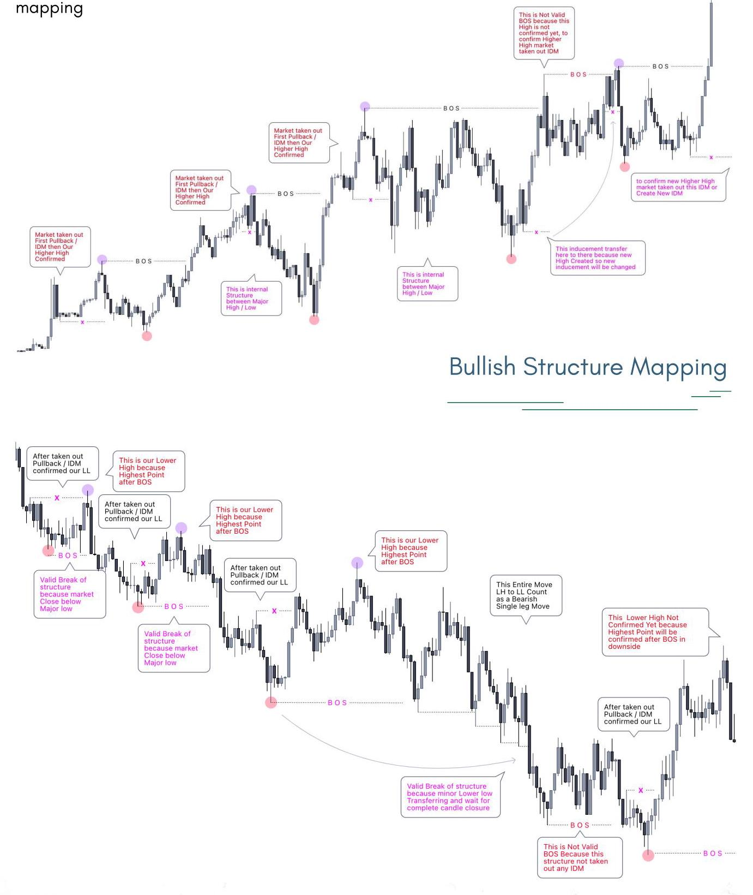
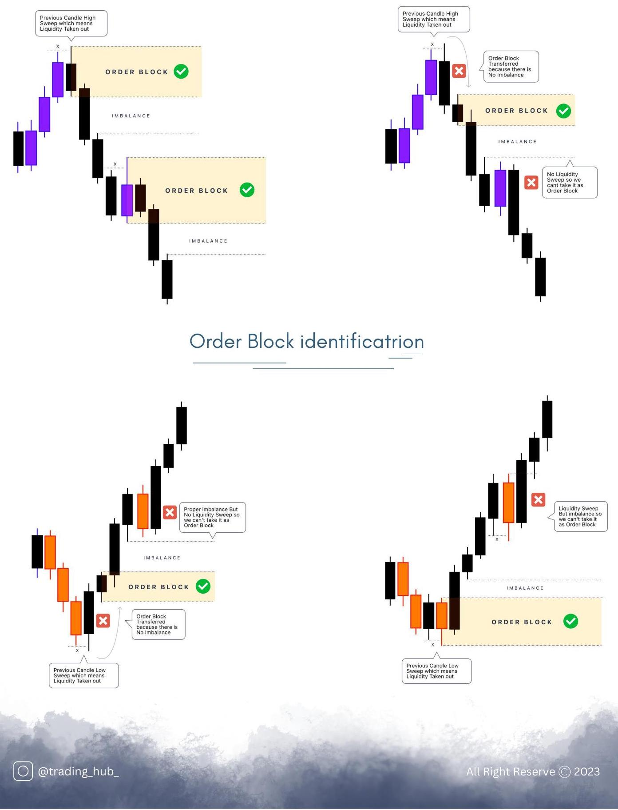

# TRADING HUB 3.0 Identify Liquidity or Become Liquidity

# 交易中心3.0:识别流动性或成为流动性提供者

Liquidity Sweep Entries Setup

流动性扫单条目设置

Bearish Order Flow

看跌订单流

Fair Value Gap

公允价值差距

ASIA Low Sweep

亚洲低扫

Prev Day Low Sweep MEMBER HANDBOOK 2023

前一日最低价扫描 2023 年会员手册

MR. KHAN

## RISK DISCLAIMER

## 风险声明

_____.来,_____.

_____. 来，_____.

TRADING HUB is not a Registered investment , Legal Tax advisor or a Broker Dealer Company. All investment and Financial Opinions Expressed by TRADING HUB are from personal research and experience and are intended as educational material. Although best efforts are made to ensure that all information is accurate and up to date, occasionally unintended errors and misprints may occur. Leverage Trading is High Risk Business so Trade Carefully on your risk research. Trade and investment own Risk, we are not Responsible for your profit and Losses.

交易中心不是注册投资机构、法定税务顾问或经纪交易商公司。交易中心表达的所有投资和财务观点均基于个人研究和经验，旨在作为教育材料。尽管已尽最大努力确保所有信息准确且最新，但偶尔仍可能出现意外错误和印刷错误。杠杆交易是高风险业务，因此请在进行风险研究后谨慎交易。交易和投资自负风险，我们不对您的盈亏负责。

We're Wishing you Successful Trading Journey.

祝您交易旅程顺利。

Most Welcome to Become Part of True Smart Money Concept, inside of this E-book you'll Learn all about SMC that how things actually works in easy to understand way. All about Structure Mapping , Liquidity Entry Mastery. You can apply anywhere like Forex Pairs , Stocks , CryptoCurrency and indices etc. Study as much Possible study again and again because maybe its take some time understand few topics but once you understand that how things actually works then definitely you'll Smash it , this is GAME CHANGER way to understand reason behind price movement.

热烈欢迎加入真正的明智资金概念。在这本电子书中，你将全面了解明智资金概念(SMC)，以及它是如何实际运作的，且讲解方式通俗易懂。涵盖结构映射、流动性进入掌握等所有内容。你可以将其应用于任何领域，如外汇货币对、股票、加密货币和指数等。尽可能多地反复学习，因为理解某些主题可能需要一些时间，但一旦你理解了它的实际运作方式，你肯定会大获成功。这是一种改变游戏规则的方式，能让你理解价格变动背后的原因。

We're Wishing you Successful Trading Journey.

我们祝愿您的交易之旅圆满成功。

## KEYWORDS SHORTCUT

## 关键词快捷方式

SMC Smart Money Concept

SMC智能资金概念

SMT Smart Money Trap

超微电路智能资金陷阱

BOS Break Of Structure

BOS(结构突破)

FBOS Fake Break Of Structure

FBOS 假结构突破

CHOCH Change Of Character

CHOCH 特征变化

IDM Inducement

IDM 诱因

OB Order Block

OB 订单块

OF Order Flow

OF 订单流

FVG Fair Value Gap

FVG 公允价值缺口

IMB Imbalance

IMB 失衡

IPA Inefficient Price Action

IPA 低效价格行为

IFC Institutional Funding Candle

IFC 机构资金蜡烛图

POI Price Of Interest

POI 关注价格

AOI Area Of Interest

AOI 关注区域

HTF Higher Time Frame

HTF 更高时间框架

LTF Lower Time Frame

LTF 更低时间框架

EQH Equal High

EQH 等高

EQL Equal Low

EQL 等低

SnR Support & Resistance

SnR 支撑位和阻力位

D2S Demand to Supply

D2S 需求到供应

S2D Supply to Demand

S2D 供应到需求

ERL Engineering Liquidity

ERL 工程流动性

BSL Buy Side Liquidity

BSL 买方流动性

SSL Sell Side Liquidity

SSL 卖方流动性

TL Trendline

TL 趋势线

PDH Previous Day High

PDH 前一日最高价

PDL Previous Day Low

PDL 前一日最低价

PWH Previous Week High

PWH 前一周最高价

PWL Previous Week Low

PWL 前一周最低价

HOD High Of the Day

HOD 当日最高价

LOD Low Of the Day

LOD 当日最低价

SOS Sign Of Strength

SOS 强势信号

SOW Sign Of Weakness

SOW 弱势信号

LQD Liquidity

LQD 流动性

## TABLE OF CONTENT

## 目录

True Mechanical Structure Mapping with Advance level Details SMC .

具有高级细节的真实机械结构映射(SMC)。

Understand BOS - CHoCH - Pullback in Depth

深入理解BOS - CHoCH - 拉回

Complete Details Order Flow - Order Block - Imbalance - Institutional Funding Candle

完整细节订单流 - 订单块 - 失衡 - 机构资金蜡烛图

Types of Liquidity (Retailer Patterns Liquidity - Smart Money Traps - Session Liquidity - Daily Liquidity)

流动性类型(零售商模式流动性 - 聪明钱陷阱 - 时段流动性 - 日流动性)

High Probability POI identifications Secrets

高概率兴趣点识别秘诀

Best Multiple Time Frame Analysis Combination

最佳多时间框架分析组合

High Probability Entries Types Explanation in Depth - Single Candle Mitigation - Ping Pong Entries - Multiple Scale Entries

高概率入场类型深度解析 - 单根蜡烛图缓解 - 乒乓球式入场 - 多尺度入场

Risk Management

风险管理

Thank You

谢谢

## IMPULSE & CORRECTION

## 冲动与回调

When Market momentum is very strong to the upside or downside those types strong unhealthy price action is called Impulsive Move, Price generally move in two way impulse and correction. you can understand like this in impulsive move lots of institutional and Banks Buying Momentum and correction phase retail traders trying to buy sell and market move in a particular range. Now i am going to explain you here in details that how its looks.

当市场上涨或下跌势头非常强劲时，那种强劲的不健康价格走势被称为冲动性走势，价格通常以两种方式波动，即冲动和回调。你可以这样理解，在冲动性走势中，大量机构和银行买入，而在回调阶段，零售交易者试图买卖，市场在特定范围内波动。现在我将在这里详细向你解释它是什么样子的。

This is Valid Pullback

这是有效的拉回

because Lowest Candle is

因为最低的蜡烛图是

This Move also taken out by B candle, so

这一走势也被B蜡烛图突破，所以

known as a this is valid Pullback.

被称为这是有效的拉回。

Corrective Move

回调走势

because K candle

因为K线蜡烛图

High Taken out

上破高位

by \( H \) candle

被\( H \)蜡烛图

This is Not Pullback because

这不是回调，因为

H candle High J Low Both

H蜡烛图的高位和J蜡烛图的低位都

are Protected, so this move

受到保护，所以这波走势

count as a Single leg

算作单边走势

All Right Reserve (C) 2023

版权所有 (C) 2023

## Remember

## 记住

When Price taken out Prev Candle High / Low then candle colors not matter may be Bullish or bearish in both scenarios are valid. one more thing Price taken out High/Low then sometimes candle close or Sweep Prev Candle High Low . Both scenarios are valid.

当价格突破前一根蜡烛图的高位/低位时，蜡烛图颜色无关紧要，两种情况(看涨或看跌)都是有效的。还有一点，当价格突破高位/低位时，有时蜡烛图会收于或扫过前一根蜡烛图的高位/低位。两种情况都是有效的。

## STRUCTURE MAPPING

## 结构映射

Smart Money Concept basically backbone of two things Structure and Liquidity, in this part we are going to discussion in details about Break of Structure and Change of Character. to marking structure usually we need one thing that is inducement to confirm structure also to take entries. Inducement are very important to marking structure, now i am going to show you exactly that how you can draw advance structure in different different situation and what kind of criterias you should follow to marking structure.

聪明钱概念基本上基于两个要素:结构和流动性。在这部分内容中，我们将详细讨论结构突破和特征变化。为了标记结构，我们通常需要一个要素来确认结构并进行入场操作。诱发性因素对于标记结构非常重要。现在我将向你展示如何在不同情况下绘制高级结构，以及在标记结构时应遵循何种标准。

Market is Bullish or Bearish doesn't Matter in both scenarios you need complete candle closure to confirm Break of structure if price candle sweep so those structure count as a Liquidity sweep / Stop hunt . Now i am going to show you some Bullish structure Diagrams that how you can identify valid and invalid BOS / CHoCH .

市场是看涨还是看跌并不重要，在两种情况下，你都需要蜡烛图完全收线才能确认结构突破。如果价格蜡烛图扫过，那么这些结构算作流动性扫盘/止损猎杀。现在我将向你展示一些看涨结构图表，告诉你如何识别有效的和无效的结构突破/特征改变。

## Remember

## 记住

These are Bullish and Bearish Chart explanations you need to understand every point very carefully and peacefully because once you understand Structure mapping clearly then rest things will be easy to understand. Again and again try to understand each point and topic as much possible then forward on next topic. This is game changer and unique way to structure

这些是看涨和看跌图表的解释，你需要非常仔细和平静地理解每一点，因为一旦你清楚地理解了结构映射，其余的内容就会很容易理解。反复尽可能多地理解每一点和每个主题，然后再进入下一个主题。这是改变游戏规则的独特结构方式

## IMBALANCE / FVG

## 失衡/价值区边缘 (FVG)

Price generally drop sharply or Push Higher in unhealthy Way then market try to pullback to fill imbalance. There are different different name Fair Value Gap / Imbalance / inefficient Price Action . Generally we use in During POI & Order Block Marking .You Can understand like this below examples .

价格通常会大幅下跌或以不健康的方式上涨，然后市场会试图回调以填补失衡。有不同的名称，如公允价值缺口/失衡/低效价格行为。一般我们在标记POI和订单块时使用。你可以通过以下例子来理解。

Bearish / Bullish Imbalance

看跌/看涨失衡

IMBALANCE

Gap Between A candle

蜡烛线之间的缺口

High and N Candle Low

第N根蜡烛线的最高价和最低价

which is Unmitidated

未缓解的

which Already Mitigated

已经缓解的

so there is Not Imbalance IMBALANCE

所以不存在失衡

Gap Between A candle

蜡烛线之间的缺口

MITIGATED High and N Candle Lov

已缓解的最高价和第N根蜡烛线的最低价

IMBALANCE so this is Callec

失衡，所以这被称为

Gap Between K candle

K线之间的缺口

High and H Candle Low Gap Between K candle

K线最高价和H线最低价之间的缺口

Gap Between K candle which Already Mitigated High and H Candle Low

K线之间已缓解的缺口，最高价和H线最低价

High and H Candle Low so there is Not Imbalance which Already Mitigated

最高价和H线最低价，所以不存在已缓解的失衡

which is Unmitigated so there is Not Imbalance

未缓解的，所以不存在失衡

so this is Called

所以这被称为

@trading_hub_ All Right Reserve (C) 2023

@交易中心_版权所有 (C) 2023

these are Given examples to find extreme imbalance Because most of the time Fill imbalance its not necessary to fill every time because there are lots of different factor to fill imbalance on specific point . imbalance mainly use during entry time to Find POI and Order Block . ORDER FLOW

这些是给定的用于发现极端失衡的示例。因为大多数时候填补失衡并不需要每次都进行，因为在特定点上有许多不同因素会导致失衡。失衡主要在入场时用于寻找价格拐点(POI)和订单块。订单流

IMBALANCE

B O S

Order Flow basically you can easily understand like this Last Buying move before drop thats is called Bearish Order Flow and same thing in Bullish Market that Last selling Move Before the Buy thats is Called Bullish Order Flow . Lets Understand more Clearly by Given Examples .

订单流基本上你可以这样轻松理解:下跌前的最后一次买入动作，这被称为看跌订单流；在牛市中，买入前的最后一次卖出动作，这被称为看涨订单流。让我们通过给定的示例更清楚地理解。

## ORDER BLOCK

## 订单块

Order Block is main Part in Smart Money Concept during entries. Order Block means where Smart Traders Entered for buys and sells . to mark any Bullish / Bearish Order Block Price must be proper imbalance and taken out Prev Candle High Low to confirm Order Block .Now we are going to discuss in more details that how we can identify and trade it. price generally react from Decesional Order Block or Extreme Order block .

订单块是智能资金概念中入场时的主要部分。订单块指的是聪明的交易者进行买卖的位置。要标记任何看涨/看跌订单块，价格必须有适当的失衡，并突破前一根蜡烛线的高点/低点来确认订单块。现在我们将更详细地讨论如何识别和交易它。价格通常会从决定性订单块或极端订单块反弹。

Now you can understand more better clearly that how things actually work in order Block, to mark oder Block Proper imbalance and Liquidity Sweep Order Block .in upcoming chapters we ’ll discuss Entries Parts in more details . these are just examples to identify valid OB . IFC CANDLE institutional Funding candle is Big Part in SMC to identify POI. When Price taken out any major Swing High or Low and also session major high low taken out that's called IFC . Basically IFC Candle mean which taken out all major StopLoss and then React from Top/ Bottom for Reversal , after taken out Liquidity you can buy or sell in LTF Confirmation . One more thing you need to understand IFC Candle colors doesn't impact and candle closing also you can use in some cases ( if Price already tap on any Other HTF POI ). Now you can understand More Better Below Given Charts Explanations . RETAIL LIQUIDITY

现在你可以更清楚地理解订单块中实际的运作方式，要标记订单块需要适当的失衡和流动性扫单订单块。在接下来的章节中我们将更详细地讨论入场部分。这些只是识别有效订单块的示例。机构资金蜡烛图(IFC蜡烛图)是智能资金概念中识别价格拐点的重要部分。当价格突破任何主要的摆动高点或低点，并且也突破了时段内的主要高低点时，这就被称为IFC。基本上，IFC蜡烛图意味着它突破了所有主要止损位，然后从顶部/底部反弹反转，突破流动性后，你可以在较低时间框架(LTF)确认时进行买卖。还有一点你需要明白，IFC蜡烛图的颜色没有影响，蜡烛图的收盘价在某些情况下也可以使用(如果价格已经触及任何其他更高时间框架(HTF)的价格拐点)。现在你可以通过下面给出的图表解释更好地理解。零售流动性

institutional Funding Candle

机构资金蜡烛图

and Now You can

现在你可以

sell Here after

在此之后卖出

Candle Closure

蜡烛图收盘

Prev Major low Sweep

前一个主要低点扫单

Internal Structure

内部结构

Majority of the traders trade based on Retail Pattern Like Trendline, Patterns, Indicators and Support & Resistance . this is Biggest Reason to manipulate Retail Patterns because Smart Money Traders ( BANKS & INST ) trade against traders . Now i am going to explain here that how traders think and then what happend after that .

大多数交易者基于零售模式进行交易，如趋势线、形态、指标以及支撑位和阻力位。这是操纵零售模式的最大原因，因为聪明的资金交易者(银行和机构)会与普通交易者反向交易。现在我将在这里解释交易者是如何思考的，以及之后会发生什么。

SELL ENTRY

卖出入场

SELL ENTRY

卖出入场

SELL ENTRY

卖出入场

RETAIL DEMAND ZONE

零售需求区

SELL ENTRY

卖出入场

Retail Traders trying to Buy

零售交易员尝试买入

failed to hold because Price

未能守住，因为价格

momentum is Bearish SMC

动能看跌(简单市场结构)

TRaders Selling

交易员卖出

Support & Resistance / EQH / EQL

支撑与阻力/均衡高/均衡低

to sell here because Strong can sell here as per single

在此处卖出，因为强者可按单一标准在此处卖出

Supply/Resistance Zone But candle Mitigation Entry

供应/阻力区，但蜡烛图缓解入场

You have to wait until taken out

你必须等待直到被突破

all Liquidity before enter .

所有流动性被消耗后再入场。

RESISTANCE OR EQUAL HIGH

阻力或等高

@trading_hub_

@trading_hub_

Trendline are big part in Retailers trading method , When you are Looking for Buy or sell after trendline broken then you need to wait for proper setup as per SMC . when Price Broke upside then think about sell setup and if price broke downside then think about Buyside as per SMC , But you need to remember some SMC Based Criteria not only based on Trendline. these given examples will help you a lot to understand things that how Trendline Traps.

趋势线在零售商交易方法中占很大一部分，当你在趋势线被突破后寻找买入或卖出时机时，你需要根据简单市场结构等待合适的设置。当价格向上突破时，考虑卖出设置；如果价格向下突破，则根据简单市场结构考虑买入设置，但你需要记住一些基于简单市场结构的标准，而不仅仅基于趋势线。这些给出的例子将极大地帮助你理解趋势线陷阱是怎么回事。

## SMART MONEY TRAP

## 聪明资金陷阱

Lots of Smart Money Traders usually trade Based on Structure and Order Block but in Reality Order Block is Not SMC. Order Block just additional Confirmation for buy or sell . when you look any order Block then dont trade blindly you have to wait for inducement or Liquidity sweep Clear Confirmation before buy sell on Order block . Let see how it work .

许多聪明资金交易员通常基于结构和订单块进行交易，但实际上订单块并非简单市场结构。订单块只是买卖的额外确认。当你看到任何订单块时，不要盲目交易，你必须等待诱导或流动性扫盘的明确确认后，再基于订单块进行买卖。让我们看看它是如何运作的。

## SESSION LIQUIDITY

## 时段流动性

Time and Price are important part in Smart Money Concept when Market taken out any Session High Low then market gives a reversal move to the upside or downside . because Every Session High / Low act Like Liquidity , in a day at least one session will be manipulate . if ASIAN + LONDON are continuation then New York gives you Reversal Move . if ASIAN Low Swept then LODON and NY will do continuation . Now Lets understand by few Examples . Session Liquidity identification

时间和价格是聪明资金概念中的重要部分。当市场突破任何时段的高低点时，市场会向上或向下反转。因为每个时段的高低点都起着流动性的作用，一天中至少有一个时段会被操纵。如果亚洲时段和伦敦时段是延续行情，那么纽约时段会给出反转行情。如果亚洲时段的低点被突破，那么伦敦时段和纽约时段会延续行情。现在让我们通过一些例子来理解。时段流动性的识别

Every Session High Low act like Liquidity because most of the traders they Put the Buy or Sell stop order below or above session High , Market need Liquidity to Push Higher or Lower and these types of Orders act like Fuel . How you Can Trade like this setups. I'll explain more better in Entry types Topic . these are few More examples about Session Liquidity .

每个时段的高低点都起着流动性的作用，因为大多数交易者会在时段高点下方或上方设置买入或卖出止损单。市场需要流动性来推动价格上涨或下跌，这些类型的订单就像燃料一样。你如何根据这样的设置进行交易呢？我会在“入场类型”主题中更详细地解释。这些是关于时段流动性的更多例子。

## DAILY CANDLE LIQUIDITY

## 日蜡烛图流动性

Prev Day Candle High / low act Like Daily Liquidity reason are simple and similar as Session Liquidity because most of the traders buying on breakout . When Market break prev candle low then most of the traders trying to sell after break previous low . same things happen in Bullish side . When Market is bearish then taken out prev Day High which is High Probability sell and Buy for short term in Bearish Market . Same thing happened in Bullish Market . after taken out Liquidity you have to switch into M15 CHoCH For confirmation . I'll Explain more better in Entries Parts . Now you can understand more better clear that How you can identify Daily Liquidity .

前一日蜡烛图的高低点起着日流动性的作用，原因很简单，与时段流动性类似，因为大多数交易者在突破时买入。当市场跌破前一日蜡烛图的低点时，大多数交易者会在跌破前低后试图卖出。在看涨行情中情况相同。当市场看跌时，突破前一日的高点，这是看跌市场中高概率的卖出点和短期买入点。在看涨市场中也是如此。突破流动性后，你必须切换到M15的“通道突破与通道收盘”(CHoCH)指标进行确认。我会在“入场部分”更详细地解释。现在你可以更好地理解如何识别日流动性了。

## POI IDENTIFICATION

## 兴趣点识别

An specific areas where you can take risk for buy and sell thats called Price Of Interest . there are different Different Types POI Session High Low which act like Liquidity But How you can identify which Liquidity we can use as a POI . Order Block also use as a POI and inducement and Liquidity . Now i am going to explain here that how many types POI work in smart Money concept and how you can identify , Lets Understand By Given Few Examples .

一个你可以进行买卖风险操作的特定区域，这被称为兴趣点(POI)。有不同类型的兴趣点，如时段高低点，它们起着流动性的作用。但是你如何识别哪些流动性可以用作兴趣点呢？订单块也可以用作兴趣点以及诱因和流动性。现在我将在这里解释在聪明资金概念中兴趣点有多少种类型以及你如何识别，让我们通过一些给定的例子来理解。

## MULTIPLE TIME FRAME

## 多时间框架

Multiple time frame analysis mostly we use to identify structure, trend, entry criterias and different different time frame depend on different types of trading style and different types of markets Like Forex , Crypto , Stock , indices , synthetics and more . You have to use 2 Time frame as a Day Trader . First I am going to show you FOREX Example.

多时间框架分析主要用于识别结构、趋势、入场标准等，不同的交易风格和不同类型的市场(如外汇、加密货币、股票、指数、合成资产等)会依赖不同的时间框架。作为日内交易者，你必须使用两个时间框架。首先我将向你展示外汇的例子。

This is CRYPTO Market example BTC USDT and you can take any currency Pair , I used H1 as a Higher Time Frame as per Day trader and Same time frame H1 you can take in Forex Market then you should use M5 LTF For confirmation .

这是加密货币市场的例子，比特币兑泰达币(BTC USDT)，你可以选择任何货币对。按照日内交易者的标准，我将H1作为更高时间框架，在外汇市场你也可以使用相同的H1时间框架，然后你应该使用M5作为更低时间框架进行确认。

LTF - M1 Now this is BANK NIFTY / STOCK Chart to show you that how you can trade in Multiple Time Frame . First identify POI in HTF which 2 way to identify POI . 1st one is buy or sell after taken out PDL / PDH and switch into LTF M5 for Buy/Sell confirmation . because Stock Market open for some specific time Only , so we don't need to use M15 H1 as a Day trader perspective as we do in Forex Crypto . so we should follow PDH / PDL to mark HTF POI and second is M5 HTF POI and M1 For entry BUT if you're following M5 as a HTF Then Mostly cases you'll see entry in M1 Single candle mitigation based . so this is Example that how you can Trade as per PDH/PDL Higher Time Frame POI .

更低时间框架 - M1 现在这是印度国家证券交易所银行指数(BANK NIFTY)/股票图表，向你展示如何在多时间框架中进行交易。首先在更高时间框架(HTF)中识别兴趣点，有两种方法可以识别兴趣点。第一种是在突破前低(PDL)/前高(PDH)后进行买卖，然后切换到更低时间框架M5进行买卖确认。因为股票市场只在特定时间开放，所以作为日内交易者，我们不需要像在外汇和加密货币市场那样使用M15和H1。所以我们应该根据前高/前低来标记更高时间框架的兴趣点，第二种是M5更高时间框架的兴趣点和M1用于入场。但是如果你将M5作为更高时间框架，那么在大多数情况下，你会看到基于M1单根蜡烛图的入场情况。所以这就是根据前高/前低更高时间框架兴趣点进行交易的例子。

## ENTRY TYPES EXPLANATION

## 入场类型解释

Everything is correct in each strategy but main part is that how we should play on POI . Now i am going to explain here all Major High Probability entry Types . that how you can take Decision in Lower time confirmation to reduce Risk and maximize your Profit . There are different different types of Entry Module Like CHoCH / BOS / FLiP / Single Candle Mitigation Entries . Let see What Happen in Lower time frame during entries .

每个策略中的一切都是正确的，但关键部分是我们应该如何在兴趣点上操作。现在我将在这里解释所有主要的高概率入场类型。以及你如何在更低时间框架确认时做出决策以降低风险并最大化利润。有不同类型的入场模块，如通道突破与通道收盘(CHoCH)/突破开盘价买入(BOS)/翻转(FLiP)/单根蜡烛图止损入场。让我们看看在入场时更低时间框架会发生什么。

CHoCH with IDM Entry Module

带有IDM入场模块的通道突破与通道收盘(CHoCH)

@trading_hub_

@trading_hub_

Flip Entry Module are very common and powerful method in smart money concept . when Price tap on HTF Supply Zone then you have to switch into Lower time frame as per our Multiple Time Frame correlation . You have to switch into LTF and wait for confirmation if price not break directly prev recent high \( / \) low as a CHoCH and take some small pullback on Order Block and not able to hold OB and failed . so this process is called Flip when Demand convert into supply D2S or Supply Convert into Demand S2D. Lets understand by given diagram and Example .

翻转入场模块在聪明资金概念中是非常常见且强大的方法。当价格触及更高时间框架的供应区时，你必须根据我们的多时间框架相关性切换到更低时间框架。你必须切换到更低时间框架并等待确认，如果价格没有直接突破前一个近期高点 \( / \) 低点，就像通道突破与通道收盘(CHoCH)那样，在订单块上有一些小回调，并且无法守住订单块而失败。所以当需求转化为供应(D2S)或供应转化为需求(S2D)时，这个过程就叫做翻转。让我们通过给定的图表和例子来理解。

FLiP with IDM Entry Module

带IDM入场模块的FLiP

CHoCH is first indication for reversal and you'll see two type entry during Change of character first one is \( \mathrm{{CHoCH}} \) with inducement and second entry \( \mathrm{{CHoCH}} \) Without inducement in this case no need inducement structure just sweep the previous low / High and we can enter as per our entry module and same thing applicable in bullish and bearish condition. lets understand by given diagrams and examples .

CHoCH是反转的首要信号，在角色转换期间你会看到两种入场类型。第一种是\( \mathrm{{CHoCH}} \)有诱因的，第二种入场\( \mathrm{{CHoCH}} \)是无诱因的。在这种情况下，不需要诱因结构，只需扫过之前的低点/高点，我们就可以根据我们的入场模块入场，同样的情况适用于看涨和看跌行情。让我们通过给定的图表和示例来理解。

CHoCH without IDM Entry Module

不带IDM入场模块的CHoCH

BOS

BOS

and Buy on

以及在……买入

Single Candle

单根蜡烛线

Order Block

订单块

BOS

CHoCH

CHoCH

After BOS market

在突破开盘价(BOS)行情之后

taken out IDM

突破IDM

and tap on Order

然后点击订单

Here

在此处

Price taken out

价格突破

Low and we can

低点，我们可以

\( \mathrm{{HTF}}\mathrm{{POI}} \) buy here without IDM at this Point

\( \mathrm{{HTF}}\mathrm{{POI}} \)此时在没有IDM的情况下在此处买入

@trading_hub_ All Right Reserve (C) 2023

@trading_hub_ 保留所有权利(C)2023

When Price tap on Higher time frame POI and give small reaction in terms of structure and recet Order Block and give small reaction and failed to hold supply and finally break and create new demand / OB then you have to wait for IDM or Demand sweep for buy confirmation because liquidity is important . after taken out Liquidity we can Buy / Sell Here . if you don't know that how do scale you're Winner and cut your'e losses then SMC not for you .Single candle mitigation is very Powerful way to add multiple entries in you're winside . single candle mitigation and sweep entries are similar , single candle mitigation not use everywhere you have to identify POI when you can add entries like this, Now i am going to explaining here That how and where you can trade trade using sweep and single candle mitigation.

当价格触及更高时间框架的POI并在结构方面给出小的反应，以及最近的订单块给出小的反应，但未能守住供应，最终突破并创造新的需求/订单块时，那么你必须等待IDM或需求扫单以确认买入，因为流动性很重要。在消耗完流动性之后我们可以在此处买卖。如果你不知道如何扩大盈利和减少损失，那么简单市场结构分析(SMC)不适合你。单根蜡烛线缓解是在盈利方面增加多个入场点的非常强大的方法。单根蜡烛线缓解和扫单入场点相似，单根蜡烛线缓解并非在所有地方都适用，你必须识别POI，才能在可以这样添加入场点的地方使用，现在我将在此解释如何以及在何处使用扫单和单根蜡烛线缓解进行交易。

Sweep and Single candle mitigation mostly work on similar Liquidity . Taken out Major High and Low thats is called Liquidity Sweep and Taken our Prev Candle High and Low that's called Single Candle Mitigation Entry . and You can also take entry on single candle Order Block based . Price must be tap on LTF POI then you can take Single candle Mitigation entry.

扫盘和单根蜡烛线缓解策略大多作用于类似的流动性情况。突破主要高低点被称为流动性扫盘，突破前一根蜡烛线的高低点则被称为单根蜡烛线缓解策略入场点。你也可以基于单根蜡烛线订单块入场。价格必须触及较低时间框架的兴趣点(POI)，然后你才能进行单根蜡烛线缓解策略入场。

Single Candle Mitigation Entry

单根蜡烛线缓解策略入场点

@trading_hub_ All Right Reserve (C) 2023

@trading_hub_ 保留所有权利 (C) 2023

When you start play on both side move major and minor thats is Ping Pong Entries . These types of entries are really toughest because few peoples can think in both side and main thing to take action for buy and sell BUT I'll make you some easy to understand things which will help you a lot to understand that where and when you should enter ot not . if you don't like to play both side then you can leave or avoid because it's not means that only Ping Pong traders can make money only. majority focus on you're strong side , for example me I like to trade SHORT (Sell ) Market . Majority of the time i Sell Market and few times I bought .to trade ping Pong first you have to identify your POI and reaction Zone / POI / Point . when market tap on your POI then identify on which level can market react and how you'll react if same thing happen as you planned . lets understand by few examples below . Always remember 2 things during Entries to identify Ping Pong, First things identify structure and if structure is bearish then always Buy on Demand or Prev Low Sweep and this buy will be short term Buy , if price tap on Supply or sweep any session high then hold for Longer run and sell in LTF Confirmation. same rules will be applicable in Bullish market if market taken out High then then sell for short term and Buy when price taken out Low or tap on demand . this Buy will be High Probability Buy .

当你开始双向交易，即操作主要趋势和次要趋势时，这就是乒乓交易入场法。这类入场方式非常难，因为很少有人能同时从两个方向思考，并且关键是要对买卖采取行动。但我会让一些事情变得易于理解，这将极大地帮助你明白何时何地应该入场。如果你不喜欢双向交易，那么你可以离开或避开，因为这并不意味着只有乒乓交易者才能赚钱。大多数人专注于自己擅长的方向，例如我，我喜欢做空市场。大多数时候我做空市场，只有少数时候做多。要进行乒乓交易，首先你必须确定你的兴趣点(POI)和反应区域/兴趣点/点位。当市场触及你的兴趣点时，确定市场会在哪个价位做出反应，以及如果事情按你计划发展你会如何反应。让我们通过下面几个例子来理解。在进行乒乓交易入场时，始终要记住两件事。首先，确定市场结构，如果结构看跌，那么总是在需求位或前低扫盘时买入，这种买入将是短期买入。如果价格触及供应位或扫过任何时段高点，那么持有更长时间，并在较低时间框架确认时卖出。在看涨市场中同样的规则适用，如果市场突破高点，那么短期卖出，当价格突破低点或触及需求位时买入。这种买入将是高概率买入。

Ping Pong Entries Explanation

乒乓交易入场法解释

## RISK MANAGEMENT

## 风险管理

Trading is game of probability then you should take risk as per your capital and own capacity there are no holy grail strategy, you have to think in Both side first think about Risk which you are taking in a trade dont think about profit , when you focus on managing risk then profit will be automatic . Lots of people do wrong side focus on profit only and start imagine in profit only they forgot about risk management because it's all about probability game so think about both side Probability. You should always take trade with proper risk management when you have own Self Live account then take 1%-2% Max in a single trade and if you have Funded account then take 0.25 - 1% risk on each trade . when trade move as per your direction then first focus on protecting your Stop Loss . when market break recent High Low then move your stop loss on Breakeven and don't try to caught 1:30-50RR because most of the traders are doing brainwash on social media to shown you big RR but in reality 1:5-1:10 are very excellent Risk Reward , you don't need to go achieve Big RR . Focus on protecting what you have and wait for High probability Entry .

交易是概率的游戏，所以你应该根据你的资金和自身能力承担风险，不存在圣杯策略。你必须从两方面考虑，首先考虑你在一笔交易中承担的风险，而不是利润。当你专注于管理风险时，利润自然会到来。很多人犯了错误，只关注利润，只想象利润，他们忘记了风险管理，因为这完全是概率游戏，所以要从两方面考虑概率。当你有自己的实盘账户时，每笔交易应该最多承担1%-2%的风险；如果你有融资账户，那么每笔交易承担0.25%-1%的风险。当交易朝着你的方向发展时，首先要专注于保护你的止损位。当市场突破近期高低点时，将你的止损位移动到盈亏平衡点，不要试图追求1:30-50的风险回报比(RR)，因为大多数交易者在社交媒体上洗脑，向你展示高风险回报比，但实际上1:5-1:10是非常好的风险回报比，你不需要追求高风险回报比。专注于保护你已有的，等待高概率入场机会。

Do not trade emotionally otherwise you can't make money , trade emotionless and always trade on High Probability POI don't trade everywhere, Patience is Big Parts to trade so wait for it and Enter when everything is fine as per plan .

不要情绪化交易，否则你无法赚钱。要冷静交易，始终在高概率兴趣点交易，不要到处交易。耐心是交易的重要部分，所以等待，当一切按计划顺利时入场。

Self Account Risk Per Trade 1-2%

实盘账户每笔交易风险1-2%

Funded Account Risk Per Trade 0.25 - 1% THANK YOU

融资账户每笔交易风险0.25 - 1% 谢谢

Thank You so much studying High Quality Education Ebook this is Game Changer if possible try to read again and again you'll learn new things every time. I Hope this is Turning point in your trading Career and will be Very Helpful to you.

非常感谢你学习这本高质量教育电子书。这是一个改变游戏规则的书，如果可能的话，尽量反复阅读，你每次都会学到新东西。我希望这是你交易生涯的转折点，对你非常有帮助。

I Have all legal right of this ebook if someone try to do any misuse reselling, copy cut paste or chart copying modification by editing the legal action action will be taken against him . if you think someone is doing this, then you can contact below, this will save the book from being misused . this is for You're Learning to Boost your trading skill .

我拥有这本电子书的所有合法权利，如果有人试图进行任何滥用行为，如转售、复制粘贴或通过编辑图表进行复制修改，将对其采取法律行动。如果你认为有人在这样做，那么你可以联系以下方式，这将防止这本书被滥用。这是为了帮助你学习以提升你的交易技能。

Your Feedback is Really important for me . What you have learned and what do you wanna suggest to others who's struggling in Smart Money Concept .Please share your Honest Review on telegram or Post on instagram story and tag @trading_hub_

你的反馈对我非常重要。你学到了什么，对于在聪明资金概念方面挣扎的其他人你想给出什么建议。请在电报上分享你诚实的评价，或者在Instagram故事上发布并@trading_hub_

Identify Liquidity or Become Liquidity

识别流动性或成为流动性

When you evolve emotion then Loss involve in you're Capital.

当你产生情绪时，损失就会侵蚀你的资金。

3 Structure + Spot the Liquidity = High Probability Entry

3种市场结构 + 识别流动性 = 高概率入场