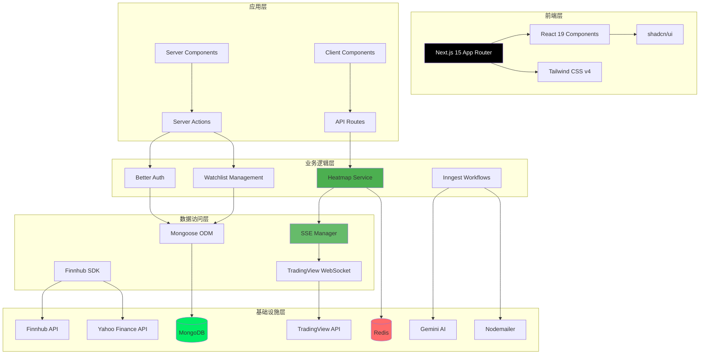
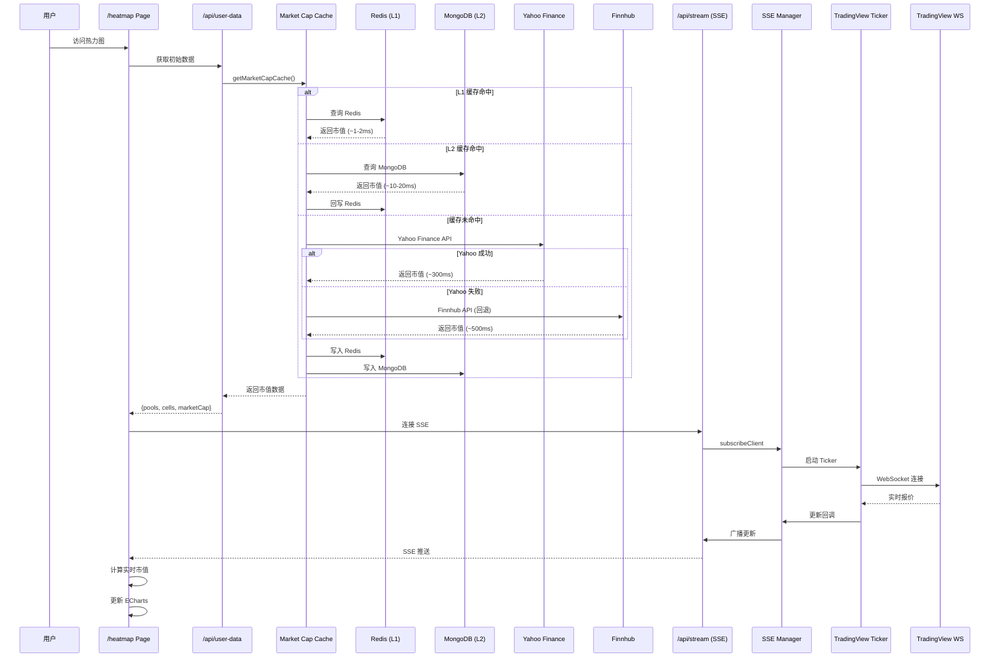

# OpenStock 完整项目架构

## 系统总览

OpenStock 是一个基于 Next.js 15 的现代化股票市场应用，采用模块化设计，支持实时数据流、AI 驱动的自动化和个性化用户体验。



## 核心模块

### 1. 认证系统 (Better Auth)


**组件**:
- `app/(auth)/sign-in/page.tsx` - 登录页面
- `app/(auth)/sign-up/page.tsx` - 注册页面
- `lib/better-auth/auth.ts` - Better Auth 配置
- `middleware/index.ts` - 路由保护

**特性**:
- Email/Password 认证
- MongoDB session 存储
- 中间件级别路由保护
- 自动重定向未登录用户

### 2. 观察列表系统 (Watchlist)


**数据模型**:
```typescript
// WatchlistGroup
{
  userId: string;
  name: string;           // "我的科技股"
  category?: string;      // "Technology"
  isSystem: boolean;
  isActive: boolean;
}

// Watchlist
{
  userId: string;
  symbol: string;         // "NASDAQ:AAPL"
  company: string;
  groupId: string;        // 关联到 WatchlistGroup
  addedAt: Date;
}
```

**组件**:
- `app/(root)/watchlists/page.tsx` - 观察列表管理页面
- `components/watchlist/WatchlistGroupManager.tsx` - 分组管理
- `lib/actions/watchlist.actions.ts` - Server Actions
- `database/models/watchlist.model.ts` - Mongoose 模型

### 3. 实时热力图系统 (Heatmap)



**核心特性**:
- ✅ 基于用户观察列表
- ✅ 按 category 分组（Pool 聚合）
- ✅ **双层缓存架构（Redis + MongoDB）** 🆕
- ✅ **多数据源容错（Yahoo Finance → Finnhub → 价格估算）** 🆕
- ✅ **智能预缓存（添加股票时异步预热）** 🆕
- ✅ TradingView WebSocket 实时报价
- ✅ SSE 流式推送
- ✅ 实时市值计算
- ✅ TradingView 风格配色
- ✅ 两级钻取（pools → stocks）

**组件**:
- `app/(root)/heatmap/page.tsx` - 热力图页面
- `components/heatmap/UserHeatmap.tsx` - 热力图组件
- `lib/tradingview/ticker.ts` - TradingView WebSocket 客户端
- `lib/tradingview/sse-manager.ts` - SSE 连接管理
- `app/api/heatmap/stream/route.ts` - SSE API
- `app/api/heatmap/user-data/route.ts` - 初始数据 API
- `lib/actions/heatmap.actions.ts` - 市值缓存逻辑 🆕
- `lib/cache/market-cap-cache-manager.ts` - 双层缓存管理器 🆕
- `lib/actions/yahoo-finance.actions.ts` - Yahoo Finance 适配器 🆕
- `lib/redis/client.ts` - Redis 客户端 🆕

**数据流**:
1. 查询用户 WatchlistGroups 和 Watchlists
2. 按 category/name 分组为 Pools
3. **市值缓存查询（三层回退）**：
   - L1: Redis 查询（~1-2ms，命中率 ~90%）
   - L2: MongoDB 查询（~10-20ms，命中率 ~8%）
   - L3: API 调用（Yahoo Finance → Finnhub → 价格估算）
4. TradingView WebSocket 获取实时报价
5. SSE 推送到前端
6. 前端计算实时市值并更新图表

### 4. 多股票视图 (Multi-Stock)


**组件**:
- `app/(root)/multi-stock/page.tsx` - 多股票页面
- `components/multi-stock/StockGridController.tsx` - 网格控制器
- `lib/adapters/multi-stock-adapter.ts` - 数据适配器

### 5. 股票详情页 (Stock Details)

```mermaid
graph TB
    A[/stocks/[symbol] Page] --> B[Symbol Info]
    A --> C[Advanced Chart]
    A --> D[Technical Analysis]
    A --> E[Company Profile]
    A --> F[Financials]
    B --> G[TradingView Widgets]
    C --> G
    D --> G
    E --> G
    F --> G
```

**组件**:
- `app/(root)/stocks/[symbol]/page.tsx` - 股票详情页
- `components/TradingViewWidget.tsx` - TradingView 组件封装

### 6. Inngest 自动化工作流


**工作流**:
1. **用户注册**: `app/user.created` → AI 生成欢迎邮件
2. **每日新闻**: cron `0 12 * * *` → 基于观察列表的个性化新闻摘要

**组件**:
- `lib/inngest/client.ts` - Inngest 客户端
- `lib/inngest/functions.ts` - 工作流函数
- `lib/inngest/prompts.ts` - AI 提示词
- `lib/nodemailer/index.ts` - 邮件传输

### 7. 全局搜索 (Command Palette)


**组件**:
- `components/SearchCommand.tsx` - 命令面板
- `lib/actions/finnhub.actions.ts` - 搜索 API

## 技术栈详解

### 前端技术

| 技术 | 版本 | 用途 |
|------|------|------|
| Next.js | 15 | App Router, SSR, API Routes |
| React | 19 | UI 组件 |
| TypeScript | Latest | 类型安全 |
| Tailwind CSS | v4 | 样式系统 |
| shadcn/ui | Latest | UI 组件库 |
| Radix UI | Latest | 无障碍组件原语 |
| ECharts | Latest | 数据可视化（热力图） |
| Lucide React | Latest | 图标库 |
| cmdk | Latest | 命令面板 |
| next-themes | Latest | 主题切换 |

### 后端技术

| 技术 | 版本 | 用途 |
|------|------|------|
| Better Auth | Latest | 认证系统 |
| MongoDB | 7 | 数据库（L2 缓存 + 持久化） |
| Mongoose | Latest | ODM |
| Redis | 7 | 缓存（L1 高速缓存） 🆕 |
| ioredis | Latest | Redis 客户端 🆕 |
| Yahoo Finance | - | 股票数据（主数据源） 🆕 |
| yahoo-finance2 | Latest | Yahoo Finance SDK 🆕 |
| Finnhub API | - | 股票数据（备用数据源） |
| TradingView | - | 图表组件 + WebSocket |
| Inngest | Latest | 工作流引擎 |
| Gemini AI | 2.5 Flash | AI 内容生成 |
| Nodemailer | Latest | 邮件发送 |
| ws | Latest | WebSocket 客户端 |

### 开发工具

| 工具 | 用途 |
|------|------|
| Turbopack | 快速构建 |
| ESLint | 代码检查 |
| Prettier | 代码格式化 |
| tsx | TypeScript 执行 |
| Docker | 容器化部署 |

## 目录结构

```
OpenStock/
├── app/                          # Next.js App Router
│   ├── (auth)/                   # 认证路由组
│   │   ├── sign-in/page.tsx
│   │   └── sign-up/page.tsx
│   ├── (root)/                   # 主应用路由组
│   │   ├── page.tsx              # Dashboard
│   │   ├── stocks/[symbol]/      # 股票详情
│   │   ├── multi-stock/          # 多股票视图
│   │   ├── watchlists/           # 观察列表管理
│   │   ├── heatmap/              # 实时热力图 🆕
│   │   ├── help/                 # 帮助页面
│   │   └── api-docs/             # API 文档
│   ├── api/                      # API 路由
│   │   ├── inngest/route.ts
│   │   └── heatmap/              # 热力图 API 🆕
│   │       ├── stream/route.ts   # SSE 实时推送
│   │       └── user-data/route.ts # 初始数据
│   ├── layout.tsx                # 根布局
│   └── globals.css               # 全局样式
│
├── components/                   # React 组件
│   ├── ui/                       # shadcn/ui 基础组件
│   ├── forms/                    # 表单组件
│   ├── heatmap/                  # 热力图组件 🆕
│   │   └── UserHeatmap.tsx
│   ├── multi-stock/              # 多股票组件
│   ├── watchlist/                # 观察列表组件
│   ├── Header.tsx
│   ├── Footer.tsx
│   ├── SearchCommand.tsx
│   └── TradingViewWidget.tsx
│
├── lib/                          # 核心逻辑库
│   ├── actions/                  # Server Actions
│   │   ├── auth.actions.ts
│   │   ├── finnhub.actions.ts
│   │   ├── watchlist.actions.ts
│   │   ├── watchlist-group.actions.ts
│   │   └── heatmap.actions.ts    # 热力图数据 🆕
│   ├── tradingview/              # TradingView 集成 🆕
│   │   ├── ticker.ts             # WebSocket 客户端
│   │   ├── sse-manager.ts        # SSE 管理器
│   │   └── mock-ticker.ts        # 模拟 Ticker（测试）
│   ├── better-auth/              # Better Auth 配置
│   ├── inngest/                  # Inngest 工作流
│   ├── nodemailer/               # 邮件服务
│   ├── adapters/                 # 数据适配器
│   ├── types/                    # TypeScript 类型
│   ├── constants.ts
│   └── utils.ts
│
├── database/                     # 数据库
│   ├── models/                   # Mongoose 模型
│   │   ├── watchlist.model.ts
│   │   └── watchlist-group.model.ts
│   └── mongoose.ts               # 数据库连接
│
├── middleware/                   # Next.js 中间件
│   └── index.ts                  # 路由保护
│
├── scripts/                      # 脚本工具
│   ├── test-db.mjs
│   ├── test-tradingview-ticker.ts
│   ├── test-mock-ticker.ts       🆕
│   └── migrate-watchlist.ts
│
├── docs/                         # 文档
│   ├── ARCHITECTURE.md           # 本文件 🆕
│   ├── HEATMAP_TESTING_GUIDE.md  🆕
│   ├── MOCK_TICKER_USAGE.md      🆕
│   ├── WATCHLIST_USAGE.md
│   ├── architecture/             # 架构图 🆕
│   │   └── heatmap-architecture.md
│   └── 执行报告/                 # 执行报告
│
├── public/                       # 静态资源
│   └── assets/
│       ├── icons/
│       └── images/
│
├── types/                        # 全局类型定义
│   └── global.d.ts
│
├── docker-compose.yml            # Docker 配置
├── Dockerfile
├── package.json
├── tsconfig.json
├── next.config.ts
├── postcss.config.mjs
├── components.json               # shadcn/ui 配置
└── README.md
```

## 数据流架构

### 1. 认证流程

```
登录请求 → Better Auth API → MongoDB 验证 → Session Cookie → Middleware 检查 → 访问受保护资源
```

### 2. 观察列表流程

```
用户操作 → Server Action → Mongoose → MongoDB → 返回结果 → UI 更新
```

### 3. 热力图数据流

```
页面加载 → 获取初始数据
    ├─ WatchlistGroups (MongoDB)
    ├─ Watchlists (MongoDB)
    └─ 市值缓存（三层架构）🆕
          ├─ L1: Redis 查询（~1-2ms，命中率 ~90%）
          ├─ L2: MongoDB 查询（~10-20ms，命中率 ~8%）
          └─ L3: API 调用（~300-500ms，命中率 ~2%）
                ├─ Yahoo Finance（主数据源，批量 100 支）
                ├─ Finnhub（备用数据源，批量 50 支）
                └─ 价格估算（最终回退：price × 10亿）

SSE 连接 → SSE Manager → TradingView Ticker → TradingView WebSocket
    ↓
实时报价更新 → 广播到所有客户端 → 前端计算实时市值 → 更新 ECharts

用户添加股票 → Watchlist 数据库 → 异步预缓存市值 🆕
    ├─ 调用 Yahoo Finance API
    └─ 写入 Redis + MongoDB
```

### 4. Inngest 工作流

```
Event/Cron → Inngest → Workflow Function → Gemini AI → Nodemailer → Email Sent
```

## 部署架构

### 开发环境

```
localhost:3000 (Next.js Dev Server)
    ↓
mongodb://localhost:27017 (Docker/Atlas)
    ↓
Finnhub API (股票数据)
    ↓
TradingView WebSocket (实时报价)
    ↓
Gemini API (AI 内容)
```

### 生产环境 (Vercel)


**特点**:
- ✅ Serverless 部署（Vercel/Netlify）
- ✅ SSE 支持（无需自定义服务器）
- ✅ MongoDB Atlas 云数据库
- ✅ 环境变量管理
- ✅ 自动 HTTPS

## 性能优化

### 前端优化

1. **Next.js 优化**:
   - App Router (RSC)
   - Turbopack 快速构建
   - 静态生成 + ISR
   - 图片优化（next/image）

2. **组件优化**:
   - ECharts 实例复用
   - 增量数据更新
   - 懒加载组件
   - React 19 优化

3. **样式优化**:
   - Tailwind CSS v4 (JIT)
   - CSS Modules
   - 暗色主题优化

### 后端优化

1. **数据库优化**:
   - MongoDB 索引
   - 连接池
   - 查询缓存
   - Mongoose lean()

2. **API 优化**:
   - **双层缓存（Redis L1 + MongoDB L2）** 🆕
   - **多数据源容错（Yahoo Finance → Finnhub → 价格估算）** 🆕
   - **智能预缓存（添加股票时异步预热）** 🆕
   - **批量请求优化（Yahoo Finance 100 支/批，Finnhub 50 支/批）** 🆕
   - **定时任务预热（每天美股收盘后 UTC 21:30）** 🆕
   - 批量请求（Finnhub）
   - 响应缓存
   - SSE 流式传输
   - 单例 Ticker 实例

3. **实时更新优化**:
   - SSE Manager 单例
   - 订阅计数管理
   - 无客户端时自动停止
   - WebSocket 连接复用

## 安全措施

### 认证与授权

- ✅ Better Auth session 管理
- ✅ Middleware 路由保护
- ✅ CSRF 保护
- ✅ 安全 Cookie (httpOnly)

### 数据保护

- ✅ MongoDB 连接加密
- ✅ 环境变量隔离
- ✅ API 密钥保护
- ✅ 输入验证和清理

### API 安全

- ✅ 速率限制（Finnhub）
- ✅ 错误处理不泄露信息
- ✅ CORS 配置
- ✅ HTTPS 强制（生产）

## 监控与日志

### 应用监控

- 服务器日志（console.log）
- SSE 连接状态
- TradingView WebSocket 状态
- Inngest 工作流状态

### 性能监控

- Next.js Analytics (Vercel)
- 页面加载时间
- API 响应时间
- 数据库查询性能

## 测试策略

### 单元测试

- TradingView Ticker 测试
- Mock Ticker 测试
- Server Actions 测试
- 工具函数测试

### 集成测试

- API 路由测试
- SSE 连接测试
- 数据库操作测试
- 认证流程测试

### 端到端测试

- 用户注册/登录
- 观察列表管理
- 热力图实时更新
- 多股票视图

## 扩展性

### 水平扩展

- ✅ Serverless 架构
- ✅ 无状态设计
- ✅ SSE Manager 单例
- ✅ MongoDB 集群支持

### 垂直扩展

- ✅ 代码分割
- ✅ 懒加载
- ✅ 缓存策略
- ✅ 数据库优化

## 最佳实践

### 代码组织

1. **模块化设计**: 按功能分组（auth, watchlist, heatmap）
2. **关注点分离**: UI/逻辑/数据访问层
3. **类型安全**: 全面的 TypeScript 覆盖
4. **一致的命名**: 遵循 Next.js 约定

### Git 工作流

1. **功能分支**: feature/branch-name
2. **提交规范**: feat/fix/docs/refactor
3. **代码审查**: Pull Request
4. **CI/CD**: 自动构建和部署

### 文档

1. **代码注释**: JSDoc 风格
2. **README**: 清晰的设置说明
3. **架构图**: Mermaid 图表
4. **API 文档**: 详细的端点说明

## 未来规划

### 短期目标

- [ ] 添加单元测试覆盖
- [x] 实现 Redis 缓存层 ✅ **已完成（2025-10-26）**
- [x] 集成 Yahoo Finance 数据源 ✅ **已完成（2025-10-26）**
- [ ] 添加更多图表类型
- [ ] 优化移动端体验

### 中期目标

- [ ] 支持更多数据源
- [ ] 添加技术指标分析
- [ ] 实现股票筛选器
- [ ] 添加价格提醒功能

### 长期目标

- [ ] 机器学习价格预测
- [ ] 社区功能（分享观察列表）
- [ ] 多语言支持
- [ ] 移动应用（React Native）

## 总结

OpenStock 采用现代化的技术栈和架构设计，实现了：

- ✅ 实时数据流（TradingView WebSocket + SSE）
- ✅ 个性化用户体验（观察列表、热力图）
- ✅ AI 驱动的自动化（Inngest + Gemini）
- ✅ 可扩展的架构（Serverless 友好）
- ✅ 优秀的开发体验（TypeScript, Turbopack）

项目持续演进中，欢迎贡献！

---

**最后更新**: 2025-10-26  
**版本**: 2.0.0  
**作者**: Open Dev Society

**变更历史**:
- v2.0.0 (2025-10-26)：添加双层缓存架构（Redis + MongoDB）、集成 Yahoo Finance、优化市值数据获取流程
- v1.0.0 (2025-10-25)：初始版本

