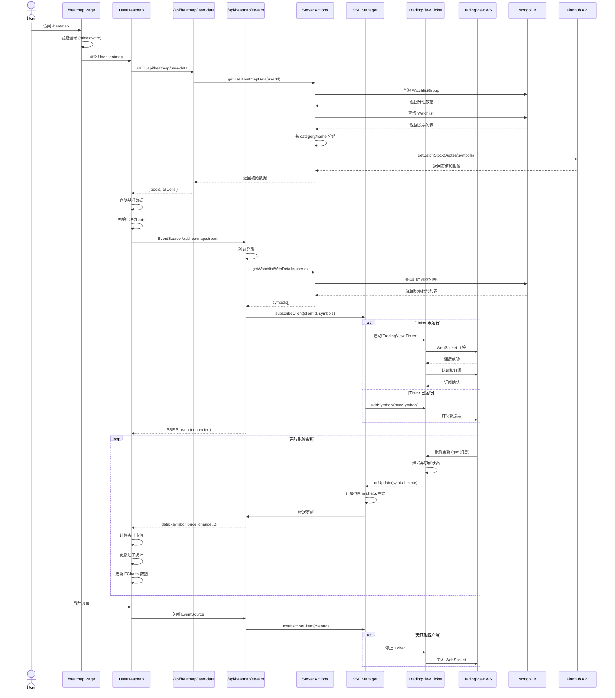
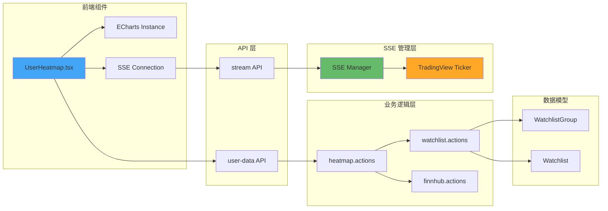
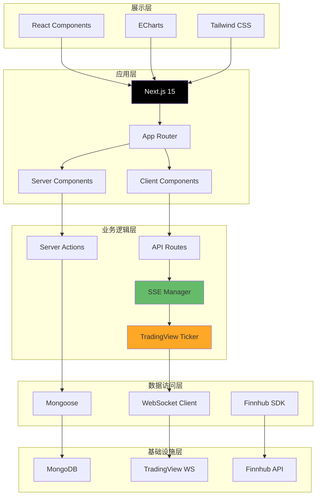
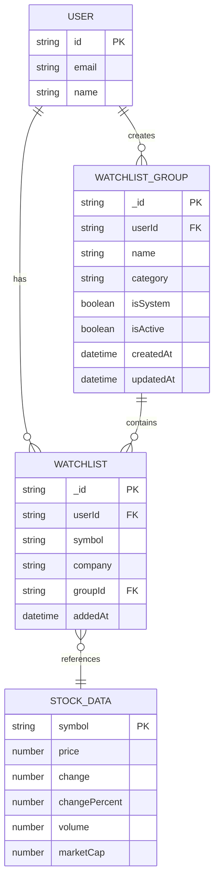
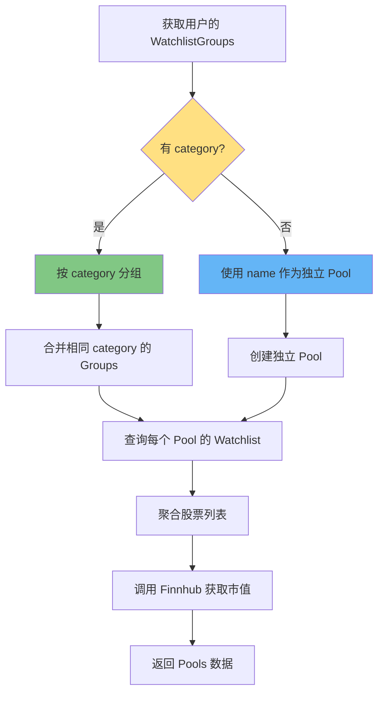
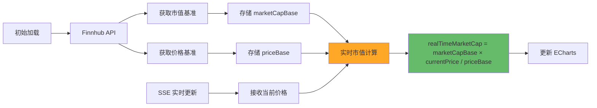
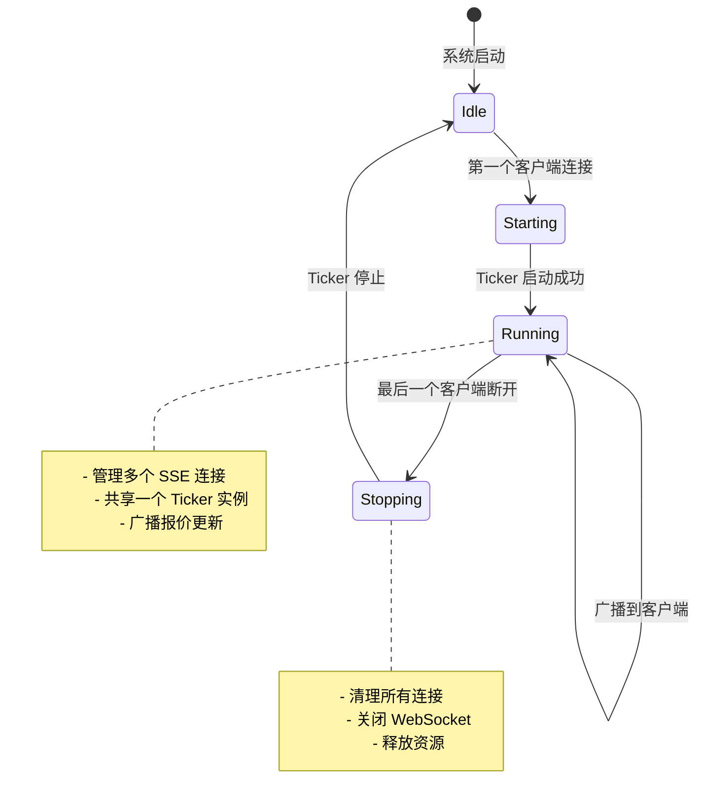
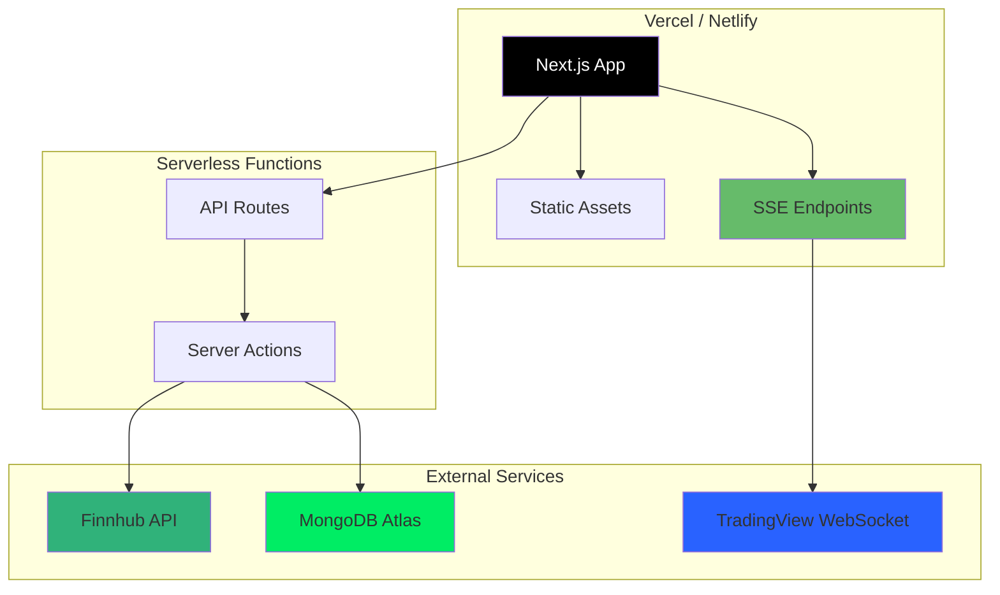
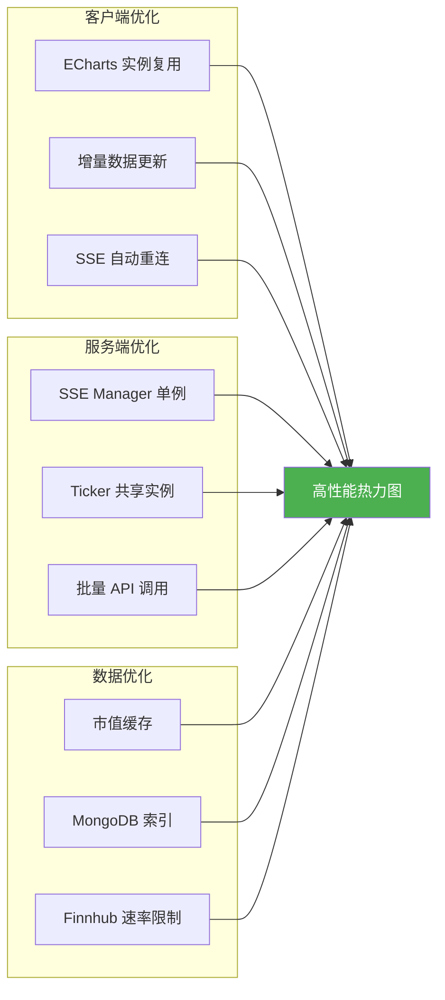

# 热力图系统架构

## 系统架构图

```mermaid
graph TB
    subgraph "客户端 (Browser)"
        A[UserHeatmap Component]
        B[EventSource - SSE Client]
        C[ECharts Treemap]
    end

    subgraph "Next.js App Router"
        D[/heatmap - Page]
        E[/api/heatmap/user-data - REST API]
        F[/api/heatmap/stream - SSE API]
    end

    subgraph "Server Actions"
        G[heatmap.actions.ts]
        H[watchlist.actions.ts]
        I[finnhub.actions.ts]
    end

    subgraph "SSE 管理层"
        J[SSE Manager Singleton]
    end

    subgraph "TradingView 集成"
        K[TradingView Ticker]
        L[wss://data.tradingview.com]
    end

    subgraph "数据存储"
        M[(MongoDB)]
        N[WatchlistGroup Collection]
        O[Watchlist Collection]
    end

    subgraph "外部 API"
        P[Finnhub API]
    end

    %% 客户端连接
    A --> B
    A --> C
    A -.初始数据.-> E
    B -.实时更新.-> F

    %% 页面路由
    D --> A

    %% API 路由
    E --> G
    F --> J

    %% Server Actions
    G --> N
    G --> O
    G --> I
    H --> N
    H --> O
    I --> P

    %% SSE 管理
    J --> K

    %% TradingView 连接
    K -.WebSocket.-> L

    %% 数据库连接
    N --> M
    O --> M

    %% 样式
    classDef client fill:#e1f5ff,stroke:#01579b,stroke-width:2px
    classDef server fill:#fff3e0,stroke:#e65100,stroke-width:2px
    classDef data fill:#f3e5f5,stroke:#4a148c,stroke-width:2px
    classDef external fill:#e8f5e9,stroke:#1b5e20,stroke-width:2px

    class A,B,C client
    class D,E,F,G,H,I,J,K server
    class M,N,O data
    class L,P external
```

## 数据流程图



## 组件关系图



## 技术栈层次图



## 数据模型 ER 图



## 热力图分组逻辑



## 市值计算流程



## SSE 连接管理



## 部署架构



## 性能优化架构



## 关键设计决策

### 1. 为什么选择 SSE 而不是 WebSocket?

| 特性 | SSE | WebSocket |
|------|-----|-----------|
| 浏览器支持 | 原生支持，自动重连 | 需要手动实现 |
| Serverless 支持 | ✅ 完全支持 | ⚠️ 需要自定义服务器 |
| 实现复杂度 | 简单（单向推送） | 复杂（双向通信） |
| 带宽效率 | 高（HTTP/2） | 高（二进制协议） |
| 适用场景 | 单向数据流 | 双向交互 |

**结论**: 热力图只需要服务器到客户端的单向数据流，SSE 是最佳选择。

### 2. 单例模式的 SSE Manager

**优势**:
- 全局共享一个 TradingView WebSocket 连接
- 降低外部 API 调用频率
- 减少资源占用
- 简化连接管理

**实现**:
```typescript
class SSEManager {
  private static instance: SSEManager | null = null;
  
  public static getInstance(): SSEManager {
    if (!SSEManager.instance) {
      SSEManager.instance = new SSEManager();
    }
    return SSEManager.instance;
  }
}
```

### 3. 实时市值计算

**为什么不每次都调用 Finnhub?**
- Finnhub API 有速率限制
- 市值变化相对缓慢
- 可以通过价格变化推算

**计算公式**:
```
实时市值 = 市值基准 × (当前价格 / 基准价格)
```

**示例**:
- 基准时刻: 市值 $2.5B, 价格 $150
- 当前时刻: 价格 $152.30
- 实时市值: $2.5B × (152.30 / 150) = $2.538B

### 4. Pool 分组策略

**设计原则**:
- 优先使用 `category` 字段聚合
- 无 `category` 时使用 `name` 作为独立显示
- 支持灵活的用户自定义分组

**示例**:
```typescript
// 用户的观察列表分组
WatchlistGroups = [
  { name: "我的科技股A", category: "Technology" },
  { name: "我的科技股B", category: "Technology" },
  { name: "个人投资", category: null },
]

// 生成的热力图 Pools
Pools = [
  { poolName: "Technology", stocks: [股票A, 股票B] },
  { poolName: "个人投资", stocks: [...] },
]
```

## 总结

本架构实现了一个高性能、可扩展、Serverless 友好的实时股票热力图系统，核心特点：

1. **纯 JavaScript 实现**: 无需 Python 服务器
2. **SSE 流式推送**: 浏览器原生支持，自动重连
3. **单例模式优化**: 全局共享 TradingView 连接
4. **实时市值计算**: 基于价格变化的高效算法
5. **灵活的分组策略**: 支持 category 聚合和自定义命名
6. **Serverless 部署**: 可直接部署到 Vercel/Netlify

